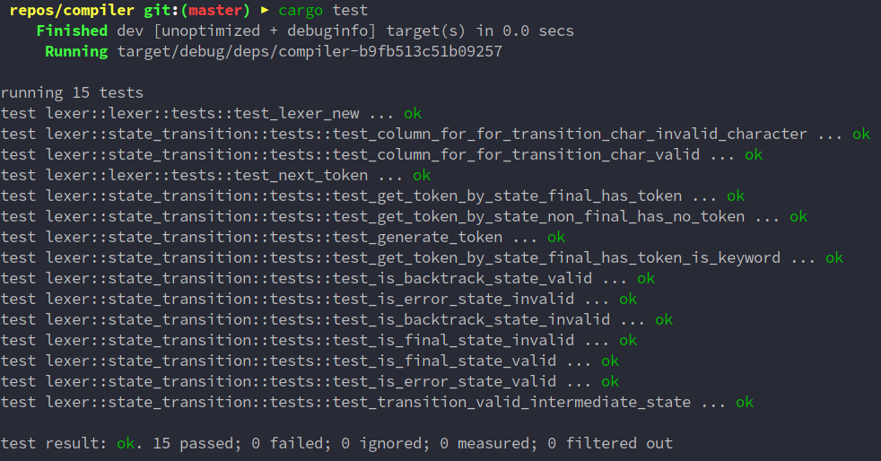
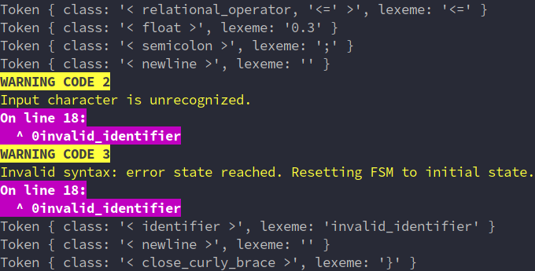
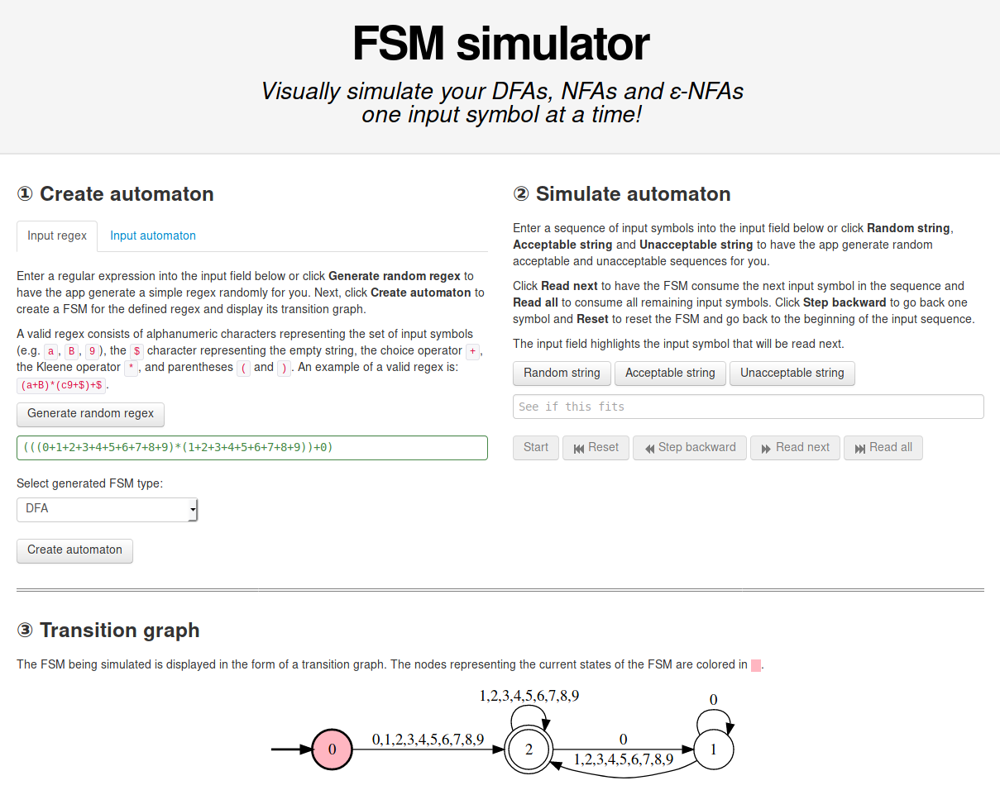

# COMP 422 - Compiler Design

## Lexical Specification

### Deterministic Finite Automaton

The following list of regular expressions were used in order to define our language's mechanism for recognizing patterns when tokenizing. For brevity's sake, a variant on the POSIX standard for regular expressions is shown.

|Pattern Label | Simplified Expression | Final Regular Expression |
|:----:|:----:|:----:|
|`letter`|`a..z` | `A..Z`|`[a-zA-Z]`|
|`digit`| `0..9`|`[0-9]`|
|`nonzero`| `1..9`|`[1-9]`|
|`alphanumeric`| `letter ¦ digit ¦ _` |`[a-zA-Z]¦[0-9]¦_`|
|`identifier`| `letter (alphanumeric)*`| `[a-zA-Z]([a-zA-Z]¦[0-9]¦_)*`|
|`fraction`| `.digit* nonzero ¦ .0`| `\.(([0-9]*[1-9])¦0)`|
|`integer`| `nonzero digit* ¦ 0`| `(([1-9][0-9]*)¦0)`|
|`float`| `integer fraction (e (+¦-)? integer)?`| `(([1-9][0-9]*)¦0)\.(([0-9]*[1-9])¦0)(e(+¦−)?(([1-9][0-9]*)¦0))?`|

From the regular expressions for tokens defined above, as well as additional simpler language features, a deterministic finite automaton (DFA) was constructed. Tools such as [AtoCC](http://atocc.de) and [FSM Simulator](http://ivanzuzak.info/noam/webapps/fsm_simulator/) were used in order to confirm the validity of the regular expressions as finite state machines.

The FSM diagram was created using [draw.io](https://www.draw.io/) and can be modified by opening the [lexer_dfa.xml](diagrams/lexer/lexer_dfa.xml) file.


### State Transition Table
The automaton implementation uses a static *state transition table*. Any change in the lexical specification above requires rebuilding this table, but should not impact the implementation of the compiler significantly.

The following legend defines some shortcuts for transition characters:

|Transition Label|List of Valid Characters|Regular Expression|
|:----:|:----:|:----:|
|`whitespace`| ` `, `\t`, `\r`|`(\ +\t+\r)`|
|`newline`| `\n` |`\n`|
|`letter`| `a..z` and `A..Z` _*except for `e`*_ |`(a+b+c+d+f+g+h+i+j+k+l+m+n+o+p+q+r+s+t+u+v+w+x+y+z)`<br/>`+`<br/>`(A+B+C+D+E+F+G+H+I+J+K+L+M+O+P+Q+R+S+T+U+V+W+X+Y+Z)`|
|`digit`| `0..9`|`(0+1+2+3+4+5+6+7+8+9)`|
|`nonzero`| `1..9`|`(1+2+3+4+5+6+7+8+9)`|

This state transition table was constructed based on the above DFA. The first column indicates the current state. The last few columns indicate any peculiarities of that state. The remaining columns represent all possible input characters which correspond to transition functions.

|Current State | `whitespace`|`newline`|`letter`|`e`|`nonzero`| `0` |`(`|`)`|`{`|`}`|`+`|`-`|`*`|`/`|`%`|`!`|`&`|`¦`|`;`|`>`|`<`|`=`|`_`|`.`| Final State | Backtrack Required | Error State | Token Class |
|:-------:|:-------:|:-----:|:------:|:-----:|:-----:|:-----:|:-----:|:-----:|:-----:|:-----:|:-----:|:-----:|:-----:|:-----:|:-----:|:-----:|:-----:|:-----:|:-----:|:-----:|:-----:|:-----:|:-----:|:-----:|:-----:|:-----:|:-----:|:-----:|
|0|0|0|0|0|0|0|0|0|0|0|0|0|0|0|0|0|0|0|0|0|0|0|0|0|0|0|1||
|1|1|8|2|2|45|35|12|13|14|15|20|21|9|4|22|27|23|25|19|28|31|16|0|0|0|0|0||
|2|3|3|2|2|2|2|3|3|3|3|3|3|3|3|3|0|3|3|3|3|3|3|2|0|0|0|0||
|3|1|1|1|1|1|1|1|1|1|1|1|1|1|1|1|1|1|1|1|1|1|1|1|1|1|1|0|`<identifier,>`<br/>`<keyword,>`|
|4|5|5|5|5|5|5|5|0|0|0|0|5|6|7|0|0|0|0|0|0|0|0|0|0|0|0|0||
|5|1|1|1|1|1|1|1|1|1|1|1|1|1|1|1|1|1|1|1|1|1|1|1|1|1|1|0|`<math_operator,/>`|
|6|1|1|1|1|1|1|1|1|1|1|1|1|1|1|1|1|1|1|1|1|1|1|1|1|1|0|0|`<open_multi_line_comment>`|
|7|1|1|1|1|1|1|1|1|1|1|1|1|1|1|1|1|1|1|1|1|1|1|1|1|1|0|0|`<single_line_comment>`|
|8|1|1|1|1|1|1|1|1|1|1|1|1|1|1|1|1|1|1|1|1|1|1|1|1|1|0|0|`<newline>`|
|9|11|11|11|11|11|11|11|0|0|0|0|11|0|10|0|0|0|0|0|0|0|0|0|0|0|0|0||
|10|1|1|1|1|1|1|1|1|1|1|1|1|1|1|1|1|1|1|1|1|1|1|1|1|1|0|0|`<close_multi_line_comment>`|
|11|1|1|1|1|1|1|1|1|1|1|1|1|1|1|1|1|1|1|1|1|1|1|1|1|1|1|0|`<math_operator,*>`|
|12|1|1|1|1|1|1|1|1|1|1|1|1|1|1|1|1|1|1|1|1|1|1|1|1|1|0|0|`<open_parens>`|
|13|1|1|1|1|1|1|1|1|1|1|1|1|1|1|1|1|1|1|1|1|1|1|1|1|1|0|0|`<close_parens>`|
|14|1|1|1|1|1|1|1|1|1|1|1|1|1|1|1|1|1|1|1|1|1|1|1|1|1|0|0|`<open_curly_brace>`|
|15|1|1|1|1|1|1|1|1|1|1|1|1|1|1|1|1|1|1|1|1|1|1|1|1|1|0|0|`<close_curly_brace>`|
|16|18|18|18|18|18|18|18|0|0|0|0|18|0|18|0|0|0|0|0|0|0|17|0|0|0|0|0||
|17|1|1|1|1|1|1|1|1|1|1|1|1|1|1|1|1|1|1|1|1|1|1|1|1|1|0|0|`<relational_operator,==>`|
|18|1|1|1|1|1|1|1|1|1|1|1|1|1|1|1|1|1|1|1|1|1|1|1|1|1|1|0|`<assignment_operator>`|
|19|1|1|1|1|1|1|1|1|1|1|1|1|1|1|1|1|1|1|1|1|1|1|1|1|1|0|0|`<semicolon>`|
|20|1|1|1|1|1|1|1|1|1|1|1|1|1|1|1|1|1|1|1|1|1|1|1|1|1|0|0|`<math_operator,+>`|
|21|1|1|1|1|1|1|1|1|1|1|1|1|1|1|1|1|1|1|1|1|1|1|1|1|1|0|0|`<math_operator,->`|
|22|1|1|1|1|1|1|1|1|1|1|1|1|1|1|1|1|1|1|1|1|1|1|1|1|1|0|0|`<math_operator,%>`|
|23|0|0|0|0|0|0|0|0|0|0|0|0|0|0|0|0|24|0|0|0|0|0|0|0|0|0|0||
|24|1|1|1|1|1|1|1|1|1|1|1|1|1|1|1|1|1|1|1|1|1|1|1|1|1|0|0|`<logical_operator,and>`|
|25|0|0|0|0|0|0|0|0|0|0|0|0|0|0|0|0|0|26|0|0|0|0|0|0|0|0|0||
|26|1|1|1|1|1|1|1|1|1|1|1|1|1|1|1|1|1|1|1|1|1|1|1|1|1|0|0|`<logical_operator,or>`|
|27|1|1|1|1|1|1|1|1|1|1|1|1|1|1|1|1|1|1|1|1|1|1|1|1|1|0|0|`<logical_operator,not>`|
|28|29|29|29|29|29|29|29|0|0|0|0|29|0|29|0|0|0|0|0|0|0|30|0|0|0|0|0||
|29|1|1|1|1|1|1|1|1|1|1|1|1|1|1|1|1|1|1|1|1|1|1|1|1|1|1|0|`<relational_operator,>>`|
|30|1|1|1|1|1|1|1|1|1|1|1|1|1|1|1|1|1|1|1|1|1|1|1|1|1|0|0|`<relational_operator,>=>`|
|31|34|34|34|34|34|34|34|0|0|0|0|34|0|34|0|0|0|0|0|32|0|33|0|0|0|0|0||
|32|1|1|1|1|1|1|1|1|1|1|1|1|1|1|1|1|1|1|1|1|1|1|1|1|1|0|0|`<relational_operator,<>>`|
|33|1|1|1|1|1|1|1|1|1|1|1|1|1|1|1|1|1|1|1|1|1|1|1|1|1|0|0|`<relational_operator,<=>`|
|34|1|1|1|1|1|1|1|1|1|1|1|1|1|1|1|1|1|1|1|1|1|1|1|1|1|1|0|`<relational_operator,<>`|
|35|44|44|0|0|0|0|0|44|44|44|44|44|44|44|44|0|44|44|44|44|44|44|0|36|0|0|0||
|36|0|0|0|0|37|37|0|0|0|0|0|0|0|0|0|0|0|0|0|0|0|0|0|0|0|0|0||
|37|43|43|0|39|37|38|0|43|43|43|43|43|43|43|43|0|43|43|43|43|43|43|0|0|0|0|0||
|38|0|0|0|0|37|38|0|0|0|0|0|0|0|0|0|0|0|0|0|0|0|0|0|0|0|0|0||
|39|0|0|0|0|42|41|0|0|0|0|40|40|0|0|0|0|0|0|0|0|0|0|0|0|0|0|0||
|40|0|0|0|0|42|41|0|0|0|0|0|0|0|0|0|0|0|0|0|0|0|0|0|0|0|0|0||
|41|43|43|0|0|0|0|0|43|43|43|43|43|43|43|43|0|43|43|43|43|43|43|0|0|0|0|0||
|42|43|43|0|0|42|42|0|43|43|43|43|43|43|43|43|0|43|43|43|43|43|43|0|0|0|0|0||
|43|1|1|1|1|1|1|1|1|1|1|1|1|1|1|1|1|1|1|1|1|1|1|1|1|1|1|0|`<float,>`|
|44|1|1|1|1|1|1|1|1|1|1|1|1|1|1|1|1|1|1|1|1|1|1|1|1|1|1|0|`<int,>`|
|45|44|44|0|0|45|45|0|44|44|44|44|44|44|44|44|0|44|44|44|44|44|44|0|36|0|0|0||

Note that for rows which correspond to final states, the next transition function is never computed, given that arriving at a final state results in a return to the initial state (after backtracking if applicable). For simplicity's sake and in order to indicate a return to the start state, these rows are filled with `1`.

### Language Keywords

The current set of keywords available in the language are:
- `if`
- `then`
- `else`
- `for`
- `class`
- `get`
- `put`
- `return`
- `program`
- `int`
- `float`
- `bool`

If an `<identifier,>` token is found, it must first be compared to the above list where a match would actually result in a `<keyword,>` token.

### Getting Started

The nightly build of the Rust programming language is required to compile this project.

First, install [`rustup`](https://www.rust-lang.org/en-US/install.html) and then run `rustup default nightly`.

You can compile and run the entire project with the following command:

```bash
cargo run -- source_example.txt
```

### Testing

#### Unit Tests

Unit tests for the compiler application can be run with:

```bash
cargo test
```



#### Integration Tests

Integration tests can be run using a simple bash script to query the output of commands:

```bash
./lexer_integration_test.sh
```

These provide appropriate test cases that test for a wide variety of valid and invalid cases in the language.


### Lexical Errors

The three types of errors generated by the lexer are:

- **Unrecoverable Error (1)**: `The input file path provided does not exist on the filesystem.`
- **Recoverable Error (2)**: `Input character is unrecognized.`
- **Recoverable Error (3)**: `Invalid syntax: error state reached. Resetting FSM to initial state.`

Every undefined transition in the above DFA results in one of the two recoverable error types, as is demonstrated by the wide variety of integration tests.

All recoverable errors display the line number and line when tokenizing the source code.



The *panic mode* technique is used for error recovery, which involves skipping invalid input characters until valid program segments are encountered. An error is reported to the user, but the lexical analysis and identification of tokens continues afterwards.

All error output is logged to both the console as well as the `error.log` file at the root of the repository whenever any lexical analysis occurs.

### Component Implementation and Architecture Overview

The lexer is designed in a modular fashion in order to a clean separation of concerns.

#### Main Function

The main function's current responsibilities are to parse the command-line application's required arguments (the path to the source code file), ensure that the provided path exists, instantiate a single lexer for the entire duration of the lexical analysis, and call the `nextToken` function until the entire source code have been tokenized.

#### Lexer

The lexer's responsibility is to manage the progress of the lexical analysis of the source code. It buffers and streams the source code to be analyzed as tokens are extracted. It maintains state about the current index of the source code being accessed, and is effectively a data structure that is passed to the state transition functions. Every call to `nextToken` results in the instantiation of a new `StateTransition` object which handles all transitions between FSM states on character input until a valid token is identified.

#### State Transitions

The `StateTransition` module contains all information relating to transition internal state of the FSM on character input. It manages it's own internal state (the current and next states) as well as the lexer's state (which characters are being read at which index of the source code).

The state transition table is a static two-dimensional array that encodes all possible transitions between all valid states. This is referred to when new characters are being read, which ultimately updates the current state and the position in the source code. The table also encodes information as to whether the current state is an error, final, or backtrack state, and the module is responsible for taking the appropriate action in these cases, which could include generating a token, modifying the buffer for the extracted lexeme, and reporting encountered error states.

#### Token

The token is a simple data structure that stores the token's class and extracted lexeme as strings in a struct. Further improvements would be to restrict the token's class to a set of defined `TokenClass` `enum` structures which encode peculiarities about certain classes (for example, comment and newline tokens), as opposed to arbitrary text input.

#### Error Output

An `ErrorType` enumeration is defined in the `output::error` module to differentiate between recoverable and unrecoverable errors. It is also responsible for defining all possible sorts of errors, as well as outputting basic error information to standard output.

#### Source Line Output

The `output::source_line` module is able to analyze the information in the lexer data structure containing the source code and the current point of analysis, and print relevant lines and characters to standard output when errors occur.


### Tools/Libraries/Techniques Chosen

- The [AtoCC](http://atocc.de) RegExp Editor application was used for converting the regular expressions identified as part of the lexical specification into DFAs. Althought the tool was used in the constructed of the DFA shown above, the current application *does not* output the generated tokens as a file in the AtoCC format.
- The [FSM simulator](http://ivanzuzak.info/noam/webapps/fsm_simulator/) website was used for a quick but less vigorous validation of the conversion of regular expressions to DFAs.
- The [lazy_static](https://docs.rs/lazy_static/1.0.0/lazy_static/) Rust library was used in order to statically store the large state transition table with values known at compile-time.
- The [Ropey](https://docs.rs/ropey/0.6.3/ropey/) library was used as a Rust library to buffer the source code using the rope data structure as it is being lexically analyzed, as well as keep track of lines and line numbers for when outputting errors. I was not able to find any other data structure that modeled the lexical analysis use case so appropriately.
- The [clap](https://clap.rs/) Rust library was used for simple command-line argument parsing. It was chosen given that it is mature and well-regarded in the Rust ecosystem.
- The [colored](https://docs.rs/colored/1.6.0/colored/) Rust library was used for prettier output during error reporting. It was chosen for it's ease of use and minimalism.




