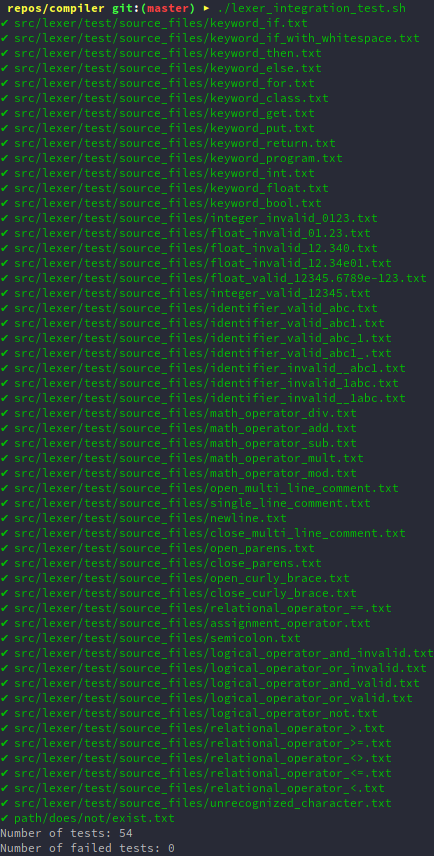

# `crs` Compiler

`crs` is a compiler implemented in Rust for a C++-like language, built for the `COMP 422 - Compiler Design` course at Concordia University. [Here](source_example.crs)'s a sample program.

## Getting Started

The nightly build of the Rust programming language is required to compile this project.

First, install [`rustup`](https://www.rust-lang.org/en-US/install.html) and then run `rustup default nightly`.

You can compile and run the entire project with the following command:

```bash
cargo run -- tests/lexer/source_example.crs
```

## Documentation

The compiler documentation can be read as [Markdown parsed by GitHub](/docs/src/SUMMARY.md) or as [HTML rendered by mdBook](/docs/rendered).

All documentation is written in markdown in `/docs/src`. The HTML version can be generated with [`mdbook`](https://github.com/rust-lang-nursery/mdBook) by running `mdbook build` in the root directory.

## Testing

### Unit Tests

Unit tests for the compiler application can be run with:

```bash
cargo test
```


### Integration Tests

Integration tests can be run using a simple bash script to query the output of commands:

```bash
./tests/lexer_integration_test.sh
```

These provide appropriate test cases that test for a wide variety of valid and invalid cases in the language.




## Component Implementation and Architecture Overview

The lexer is designed in a modular fashion in order to a clean separation of concerns.

### Main Function

The main function's current responsibilities are to parse the command-line application's required arguments (the path to the source code file), ensure that the provided path exists, instantiate a single lexer for the entire duration of the lexical analysis, and call the `nextToken` function until the entire source code have been tokenized.

### Lexer

The lexer's responsibility is to manage the progress of the lexical analysis of the source code. It buffers and streams the source code to be analyzed as tokens are extracted. It maintains state about the current index of the source code being accessed, and is effectively a data structure that is passed to the state transition functions. Every call to `nextToken` results in the instantiation of a new `StateTransition` object which handles all transitions between FSM states on character input until a valid token is identified.

### State Transitions

The `StateTransition` module contains all information relating to transition internal state of the FSM on character input. It manages it's own internal state (the current and next states) as well as the lexer's state (which characters are being read at which index of the source code).

The state transition table is a static two-dimensional array that encodes all possible transitions between all valid states. This is referred to when new characters are being read, which ultimately updates the current state and the position in the source code. The table also encodes information as to whether the current state is an error, final, or backtrack state, and the module is responsible for taking the appropriate action in these cases, which could include generating a token, modifying the buffer for the extracted lexeme, and reporting encountered error states.

### Token

The token is a simple data structure that stores the token's class and extracted lexeme as strings in a struct. Further improvements would be to restrict the token's class to a set of defined `TokenClass` `enum` structures which encode peculiarities about certain classes (for example, comment and newline tokens), as opposed to arbitrary text input.

### Error Output

An `ErrorType` enumeration is defined in the `output::error` module to differentiate between recoverable and unrecoverable errors. It is also responsible for defining all possible sorts of errors, as well as outputting basic error information to standard output.

### Source Line Output

The `output::source_line` module is able to analyze the information in the lexer data structure containing the source code and the current point of analysis, and print relevant lines and characters to standard output when errors occur.


## Tools/Libraries/Techniques Chosen

- The [AtoCC](http://atocc.de) RegExp Editor application was used for converting the regular expressions identified as part of the lexical specification into DFAs. Althought the tool was used in the constructed of the DFA shown above, the current application *does not* output the generated tokens as a file in the AtoCC format.
- The [FSM simulator](http://ivanzuzak.info/noam/webapps/fsm_simulator/) website was used for a quick but less vigorous validation of the conversion of regular expressions to DFAs.
- The [lazy_static](https://docs.rs/lazy_static/1.0.0/lazy_static/) Rust library was used in order to statically store the large state transition table with values known at compile-time.
- The [Ropey](https://docs.rs/ropey/0.6.3/ropey/) library was used as a Rust library to buffer the source code using the rope data structure as it is being lexically analyzed, as well as keep track of lines and line numbers for when outputting errors. I was not able to find any other data structure that modeled the lexical analysis use case so appropriately.
- The [clap](https://clap.rs/) Rust library was used for simple command-line argument parsing. It was chosen given that it is mature and well-regarded in the Rust ecosystem.
- The [colored](https://docs.rs/colored/1.6.0/colored/) Rust library was used for prettier output during error reporting. It was chosen for it's ease of use and minimalism.


