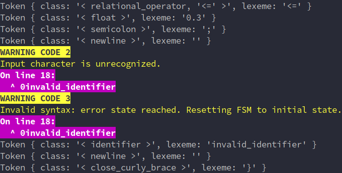

# `crs` Lexer

## Lexical Specification

### Deterministic Finite Automaton

The following list of regular expressions were used in order to define our language's mechanism for recognizing patterns when tokenizing. For brevity's sake, a variant on the POSIX standard for regular expressions is shown.

|Pattern Label | Simplified Expression | Final Regular Expression |
|:----:|:----:|:----:|
|`letter`|`a..z¦A..Z`|`[a-zA-Z]`|
|`digit`| `0..9`|`[0-9]`|
|`nonzero`| `1..9`|`[1-9]`|
|`alphanumeric`| `letter ¦ digit ¦ _` |`[a-zA-Z]¦[0-9]¦_`|
|`identifier`| `letter (alphanumeric)*`| `[a-zA-Z]([a-zA-Z]¦[0-9]¦_)*`|
|`fraction`| `.digit* nonzero ¦ .0`| `\.(([0-9]*[1-9])¦0)`|
|`integer`| `nonzero digit* ¦ 0`| `(([1-9][0-9]*)¦0)`|
|`float`| `integer fraction (e (+¦-)? integer)?`| `(([1-9][0-9]*)¦0)\.(([0-9]*[1-9])¦0)(e(+¦−)?(([1-9][0-9]*)¦0))?`|

From the regular expressions for tokens defined above, as well as additional simpler language features, a deterministic finite automaton (DFA) was constructed. Tools such as [AtoCC](http://atocc.de) and [FSM Simulator](http://ivanzuzak.info/noam/webapps/fsm_simulator/) were used in order to confirm the validity of the regular expressions as finite state machines.

The FSM diagram was created using [draw.io](https://www.draw.io/) and can be modified by opening the [lexer_dfa.xml](assets/diagrams/lexer/lexer_dfa.xml) file.

## State Transition Table
The automaton implementation uses a static *state transition table*. Any change in the lexical specification above requires rebuilding this table, but should not impact the implementation of the compiler significantly.

The following legend defines some shortcuts for transition characters:

|Transition Label|List of Valid Characters|Regular Expression|
|:----:|:----:|:----:|
|`whitespace`| ` `, `\t`, `\r`|`(\ +\t+\r)`|
|`newline`| `\n` |`\n`|
|`letter`| `a..z` and `A..Z` _*except for `e`*_ |`(a+b+c+d+f+g+h+i+j+k+l+m+n+o+p+q+r+s+t+u+v+w+x+y+z)` `+` `(A+B+C+D+E+F+G+H+I+J+K+L+M+O+P+Q+R+S+T+U+V+W+X+Y+Z)`|
|`digit`| `0..9`|`(0+1+2+3+4+5+6+7+8+9)`|
|`nonzero`| `1..9`|`(1+2+3+4+5+6+7+8+9)`|

This state transition table was constructed based on the above DFA. The first column indicates the current state. The last few columns indicate any peculiarities of that state. The remaining columns represent all possible input characters which correspond to transition functions.

|Current State | `whitespace`|`newline`|`letter`|`e`|`nonzero`| `0` |`(`|`)`|`{`|`}`|`+`|`-`|`*`|`/`|`%`|`!`|`&`|`¦`|`;`|`>`|`<`|`=`|`_`|`.`|`:`|`[`|`]`| Final State | Backtrack Required | Error State | Token Class |
|:-------:|:-------:|:-----:|:------:|:-----:|:-----:|:-----:|:-----:|:-----:|:-----:|:-----:|:-----:|:-----:|:-----:|:-----:|:-----:|:-----:|:-----:|:-----:|:-----:|:-----:|:-----:|:-----:|:-----:|:-----:|:-----:|:-----:|:-----:|:-----:|:-----:|:-----:|:-----:|
|0|0|0|0|0|0|0|0|0|0|0|0|0|0|0|0|0|0|0|0|0|0|0|0|0|0|0|0|0|0|1||
|1|1|8|2|2|45|35|12|13|14|15|20|21|9|4|22|27|23|25|19|28|31|16|0|51|46|49|50|0|0|0||
|2|3|3|2|2|2|2|3|3|3|3|3|3|3|3|3|0|3|3|3|3|3|3|2|3|3|3|3|0|0|0||
|3|1|1|1|1|1|1|1|1|1|1|1|1|1|1|1|1|1|1|1|1|1|1|1|1|1|1|1|1|1|0|`<identifier,>` `<keyword,>`|
|4|5|5|5|5|5|5|5|0|0|0|0|5|6|7|0|0|0|0|0|0|0|0|0|0|0|0|0|0|0|0||
|5|1|1|1|1|1|1|1|1|1|1|1|1|1|1|1|1|1|1|1|1|1|1|1|1|1|1|1|1|1|0|`<math_operator,/>`|
|6|1|1|1|1|1|1|1|1|1|1|1|1|1|1|1|1|1|1|1|1|1|1|1|1|1|1|1|1|0|0|`<open_multi_line_comment>`|
|7|1|1|1|1|1|1|1|1|1|1|1|1|1|1|1|1|1|1|1|1|1|1|1|1|1|1|1|1|0|0|`<single_line_comment>`|
|8|1|1|1|1|1|1|1|1|1|1|1|1|1|1|1|1|1|1|1|1|1|1|1|1|1|1|1|1|0|0|`<newline>`|
|9|11|11|11|11|11|11|11|0|0|0|0|11|0|10|0|0|0|0|0|0|0|0|0|0|0|0|0|0|0|0||
|10|1|1|1|1|1|1|1|1|1|1|1|1|1|1|1|1|1|1|1|1|1|1|1|1|1|1|1|1|0|0|`<close_multi_line_comment>`|
|11|1|1|1|1|1|1|1|1|1|1|1|1|1|1|1|1|1|1|1|1|1|1|1|1|1|1|1|1|1|0|`<math_operator,*>`|
|12|1|1|1|1|1|1|1|1|1|1|1|1|1|1|1|1|1|1|1|1|1|1|1|1|1|1|1|1|0|0|`<open_parens>`|
|13|1|1|1|1|1|1|1|1|1|1|1|1|1|1|1|1|1|1|1|1|1|1|1|1|1|1|1|1|0|0|`<close_parens>`|
|14|1|1|1|1|1|1|1|1|1|1|1|1|1|1|1|1|1|1|1|1|1|1|1|1|1|1|1|1|0|0|`<open_curly_brace>`|
|15|1|1|1|1|1|1|1|1|1|1|1|1|1|1|1|1|1|1|1|1|1|1|1|1|1|1|1|1|0|0|`<close_curly_brace>`|
|16|18|18|18|18|18|18|18|0|0|0|0|18|0|18|0|0|0|0|0|0|0|17|0|0|0|0|0|0|0|0||
|17|1|1|1|1|1|1|1|1|1|1|1|1|1|1|1|1|1|1|1|1|1|1|1|1|1|1|1|1|0|0|`<relational_operator,==>`|
|18|1|1|1|1|1|1|1|1|1|1|1|1|1|1|1|1|1|1|1|1|1|1|1|1|1|1|1|1|1|0|`<assignment_operator>`|
|19|1|1|1|1|1|1|1|1|1|1|1|1|1|1|1|1|1|1|1|1|1|1|1|1|1|1|1|1|0|0|`<semicolon>`|
|20|1|1|1|1|1|1|1|1|1|1|1|1|1|1|1|1|1|1|1|1|1|1|1|1|1|1|1|1|0|0|`<math_operator,+>`|
|21|1|1|1|1|1|1|1|1|1|1|1|1|1|1|1|1|1|1|1|1|1|1|1|1|1|1|1|1|0|0|`<math_operator,->`|
|22|1|1|1|1|1|1|1|1|1|1|1|1|1|1|1|1|1|1|1|1|1|1|1|1|1|1|1|1|0|0|`<math_operator,%>`|
|23|0|0|0|0|0|0|0|0|0|0|0|0|0|0|0|0|24|0|0|0|0|0|0|0|0|0|0|0|0|0||
|24|1|1|1|1|1|1|1|1|1|1|1|1|1|1|1|1|1|1|1|1|1|1|1|1|1|1|1|1|0|0|`<logical_operator,and>`|
|25|0|0|0|0|0|0|0|0|0|0|0|0|0|0|0|0|0|26|0|0|0|0|0|0|0|0|0|0|0|0||
|26|1|1|1|1|1|1|1|1|1|1|1|1|1|1|1|1|1|1|1|1|1|1|1|1|1|1|1|1|0|0|`<logical_operator,or>`|
|27|1|1|1|1|1|1|1|1|1|1|1|1|1|1|1|1|1|1|1|1|1|1|1|1|1|1|1|1|0|0|`<logical_operator,not>`|
|28|29|29|29|29|29|29|29|0|0|0|0|29|0|29|0|0|0|0|0|0|0|30|0|0|0|0|0|0|0|0||
|29|1|1|1|1|1|1|1|1|1|1|1|1|1|1|1|1|1|1|1|1|1|1|1|1|1|1|1|1|1|0|`<relational_operator,>>`|
|30|1|1|1|1|1|1|1|1|1|1|1|1|1|1|1|1|1|1|1|1|1|1|1|1|1|1|1|1|0|0|`<relational_operator,>=>`|
|31|34|34|34|34|34|34|34|0|0|0|0|34|0|34|0|0|0|0|0|32|0|33|0|0|0|0|0|0|0|0||
|32|1|1|1|1|1|1|1|1|1|1|1|1|1|1|1|1|1|1|1|1|1|1|1|1|1|1|1|1|0|0|`<relational_operator,<>>`|
|33|1|1|1|1|1|1|1|1|1|1|1|1|1|1|1|1|1|1|1|1|1|1|1|1|1|1|1|1|0|0|`<relational_operator,<=>`|
|34|1|1|1|1|1|1|1|1|1|1|1|1|1|1|1|1|1|1|1|1|1|1|1|1|1|1|1|1|1|0|`<relational_operator,<>`|
|35|44|44|0|0|0|0|0|44|44|44|44|44|44|44|44|0|44|44|44|44|44|44|0|36|0|0|44|0|0|0||
|36|0|0|0|0|37|37|0|0|0|0|0|0|0|0|0|0|0|0|0|0|0|0|0|0|0|0|0|0|0|0||
|37|43|43|0|39|37|38|0|43|43|43|43|43|43|43|43|0|43|43|43|43|43|43|0|0|0|0|43|0|0|0||
|38|0|0|0|0|37|38|0|0|0|0|0|0|0|0|0|0|0|0|0|0|0|0|0|0|0|0|0|0|0|0||
|39|0|0|0|0|42|41|0|0|0|0|40|40|0|0|0|0|0|0|0|0|0|0|0|0|0|0|0|0|0|0||
|40|0|0|0|0|42|41|0|0|0|0|0|0|0|0|0|0|0|0|0|0|0|0|0|0|0|0|0|0|0|0||
|41|43|43|0|0|0|0|0|43|43|43|43|43|43|43|43|0|43|43|43|43|43|43|0|0|0|0|43|0|0|0||
|42|43|43|0|0|42|42|0|43|43|43|43|43|43|43|43|0|43|43|43|43|43|43|0|0|0|0|43|0|0|0||
|43|1|1|1|1|1|1|1|1|1|1|1|1|1|1|1|1|1|1|1|1|1|1|1|1|1|1|1|1|1|0|`<float,>`|
|44|1|1|1|1|1|1|1|1|1|1|1|1|1|1|1|1|1|1|1|1|1|1|1|1|1|1|1|1|1|0|`<int,>`|
|45|44|44|0|0|45|45|0|44|44|44|44|44|44|44|44|0|44|44|44|44|44|44|0|36|0|0|44|0|0|0||
|46|48|48|48|0|0|0|0|0|0|0|0|0|0|48|0|0|0|0|0|0|0|0|0|0|47|0|0|0|0|0||
|47|1|1|1|1|1|1|1|1|1|1|1|1|1|1|1|1|1|1|1|1|1|1|1|1|1|1|1|1|0|0|`<scope_resolution_operator>`|
|48|1|1|1|1|1|1|1|1|1|1|1|1|1|1|1|1|1|1|1|1|1|1|1|1|1|1|1|1|1|0|`<inheritance_operator>`|
|49|1|1|1|1|1|1|1|1|1|1|1|1|1|1|1|1|1|1|1|1|1|1|1|1|1|1|1|1|0|0|`<open_square_bracket>`|
|50|1|1|1|1|1|1|1|1|1|1|1|1|1|1|1|1|1|1|1|1|1|1|1|1|1|1|1|1|0|0|`<close_square_bracket>`|
|51|1|1|1|1|1|1|1|1|1|1|1|1|1|1|1|1|1|1|1|1|1|1|1|1|1|1|1|1|0|0|`<accessor_operator,.>`|

Note that for rows which correspond to final states, the next transition function is never computed, given that arriving at a final state results in a return to the initial state (after backtracking if applicable). For simplicity's sake and in order to indicate a return to the start state, these rows are filled with `1`.

## Language Keywords

The current set of keywords available in the language are:
- `if`
- `then`
- `else`
- `for`
- `class`
- `get`
- `put`
- `return`
- `program`
- `int`
- `float`
- `bool`

If an `<identifier,>` token is found, it must first be compared to the above list where a match would actually result in a `<keyword,>` token.

## Lexical Errors

The three types of errors generated by the lexer are:

- **Unrecoverable Error (1)**: `The input file path provided does not exist on the filesystem.`
- **Recoverable Error (2)**: `Input character is unrecognized.`
- **Recoverable Error (3)**: `Invalid syntax: error state reached. Resetting FSM to initial state.`

Every undefined transition in the above DFA results in one of the two recoverable error types, as is demonstrated by the wide variety of integration tests.

All recoverable errors display the line number and line when tokenizing the source code.

The *panic mode* technique is used for error recovery, which involves skipping invalid input characters until valid program segments are encountered. An error is reported to the user, but the lexical analysis and identification of tokens continues afterwards.

All error output is logged to both the console as well as the `error.log` file at the root of the repository whenever any lexical analysis occurs.

