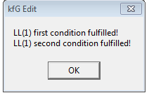

# `crs` Syntatic Analysis

## Context-Free Language Grammar Analysis

### EBNF Grammar

The specification for the syntactic analysis of the language is shown with the productions below in EBNF syntax.

| LHS | &rarr; | RHS |
|:---:|:----:|:----:|
| _prog_ | &rarr; | {_classDecl_} {_funcDef_} `program` _funcBody_ `;`|
| _classDecl_ | &rarr; | `class` `id` [`:` `id` {`,` `id`}] `{` {_varDecl_} {_funcDecl_} `}` `;` |
| _funcDecl_ | &rarr; | _type_ `id` `(` _fParams_ `)` `;` |
| _funcHead_ | &rarr; | _type_ [ `id` `::` ] `id` `(` _fParams_ `)` |
| _funcDef_ | &rarr; | _funcHead_ _funcBody_ `;` |
| _funcBody_ | &rarr; | `{` {_varDecl_} {_statement_} `}` |
| _varDecl_ | &rarr; | _type_ `id` {_arraySize_} `;` |
| _statement_ | &rarr; | _assignStat_ \| <br/> `if` `(` _expr_ `)` `then` _statBlock_ `;` \| <br/> `for` `(` _type_ `id` _assignOp_ _expr_ `;` _relExpr_ `;` _assignStat_  `)` _statBlock_ `;` \| <br/> `get` `(` _variable_ `)` `;` \| <br/> `put` `(` _expr_ `)` `;` \| <br/> `return` `(` _expr_ `)` `;` |
| _assignStat_ | &rarr; | _variable_ _assignOp_ _expr_ |
| _statBlock_ | &rarr; | `{` {_statement_} `}` \| _statement_ \| &epsilon; |
| _expr_ | &rarr; | _arithExpr_ \| _relExpr_ |
| _relExpr_ | &rarr; | _arithExpr_ _relOp_ _arithExpr_ |
| _arithExpr_ | &rarr; | _arithExpr_ _addOp_ _term_ \| _term_ |
| _sign_ | &rarr; | `+` \| `-` |
| _term_ | &rarr; | _term_ _multOp_ _factor_ \| _factor_ |
| _factor_ | &rarr; | _variable_ \| <br/> _functionCall_ \| <br/> `intNum` \| <br/> `floatNum` \| <br/> `(` _arithExpr_ `)` \| <br/> (`not` \| `!`) _factor_ \| <br/> _sign_ _factor_ |
| _variable_ | &rarr; | {_idnest_} `id` {_indice_} |
| _functionCall_ | &rarr; | {_idnest_} `id` `(` _aParams_ `)` |
| _idnest_ | &rarr; | `id` {_indice_} `.` \| `id` `(` _aParams_ `)` `.` |
| _indice_ | &rarr; | `[` _arithExpr_ `]` |
| _arraySize_ | &rarr; | `[` `intNum` `]` |
| _type_ | &rarr; | `int` \| `float` \| `id` |
| _fParams_ | &rarr; | _type_ `id` {_arraySize_} {_fParamsTail_} \| &epsilon; |
| _aParams_ | &rarr; | _expr_ {_aParamsTail_} \| &epsilon; |
| _fParamsTail_ | &rarr; | `,` _type_ `id` {_arraySize_} |
| _aParamsTail_ | &rarr; | `,` _expr_ |
| _assignOp_ | &rarr; | `=` |
| _relOp_ | &rarr; | `==` \| `<>` \| `<` \| `>` \| `<=` \| `>=` |
| _addOp_ | &rarr; | `+` \| `-` \| `or` \| `¦¦` |
| _multOp_ | &rarr; | `*` \| `/` \| `and` \| `&&` |

### BNF Grammar

An EBNF grammar can be converted to a BNF grammar by applying the following rules:

- For every instance of {_X_}, extract it to a new nonterminal _Y_ and add the production _Y_ &rarr; _Y_ _X_ | &epsilon;.
- For every instance of [_X_], extract it to a new nonterminal _Y_ and add the production _Y_ &rarr; _X_ | &epsilon;.
- For every instance of (_X_), extract it to a new nonterminal _Y_ and add the production _Y_ &rarr; _X_.

The syntactic language specification in EBNF format was converted to a BNF grammar shown below.

| LHS | &rarr; | RHS |
|:---:|:----:|:----:|
| _prog_ | &rarr; | _classDeclRecursion_ _funcDefRecursion_ `program` _funcBody_ `;`|
| _classDeclRecursion_ | &rarr; | _classDeclRecursion_ _classDecl_ \| &epsilon; |
| _classDecl_ | &rarr; | `class` `id` _optionalInheritance_ `{` _varDeclRecursion_ _funcDeclRecursion_ `}` `;` |
| _optionalInheritance_ | &rarr; | `:` `id` _MultipleSuperClasses_ \| &epsilon;|
| _MultipleSuperClasses_ | &rarr; | _MultipleSuperClasses_ `,` `id` \| &epsilon; |
| _funcDeclRecursion_ | &rarr; | _funcDeclRecursion_ _funcDecl_ \| &epsilon; |
| _funcDecl_ | &rarr; | _type_ `id` `(` _fParams_ `)` `;` |
| _funcHead_ | &rarr; | _type_ _optionalNamespace_ `id` `(` _fParams_ `)` |
| _optionalNamespace_ | &rarr; |  `id` `::` \| &epsilon;|
| _funcDefRecursion_ | &rarr; | _funcDefRecursion_ _funcDef_ \| &epsilon; |
| _funcDef_ | &rarr; | _funcHead_ _funcBody_ `;` |
| _funcBody_ | &rarr; | `{` _varDeclRecursion_ _statementRecursion_ `}` |
| _varDeclRecursion_ | &rarr; | _varDeclRecursion_ _varDecl_ \| &epsilon; |
| _varDecl_ | &rarr; | _type_ `id` _arraySizeRecursion_ `;` |
| _statementRecursion_ | &rarr; | _statementRecursion_ _statement_ \| &epsilon; |
| _statement_ | &rarr; | _assignStat_ \| <br/> `if` `(` _expr_ `)` `then` _statBlock_ `;` \| <br/> `for` `(` _type_ `id` _assignOp_ _expr_ `;` _relExpr_ `;` _assignStat_  `)` _statBlock_ `;` \| <br/> `get` `(` _variable_ `)` `;` \| <br/> `put` `(` _expr_ `)` `;` \| <br/> `return` `(` _expr_ `)` `;` |
| _assignStat_ | &rarr; | _variable_ _assignOp_ _expr_ |
| _statBlock_ | &rarr; | `{` _statementRecursion_ `}` \| _statement_ \| &epsilon; |
| _expr_ | &rarr; | _arithExpr_ \| _relExpr_ |
| _relExpr_ | &rarr; | _arithExpr_ _relOp_ _arithExpr_ |
| _arithExpr_ | &rarr; | _arithExpr_ _addOp_ _term_ \| _term_ |
| _sign_ | &rarr; | `+` \| `-` |
| _term_ | &rarr; | _term_ _multOp_ _factor_ \| _factor_ |
| _factor_ | &rarr; | _variable_ \| <br/> _functionCall_ \| <br/> `intNum` \| <br/> `floatNum` \| <br/> `(` _arithExpr_ `)` \| <br/> _negationOperator_ _factor_ \| <br/> _sign_ _factor_ |
| _negationOperator_ | &rarr; | `not` \| `!` |
| _variable_ | &rarr; | _idnestRecursion_ `id` _indiceRecursion_ |
| _functionCall_ | &rarr; | _idnestRecursion_ `id` `(` _aParams_ `)` |
| _idnestRecursion_ | &rarr; | _idnestRecursion_ _idnest_ \| &epsilon; |
| _idnest_ | &rarr; | `id` _indiceRecursion_ `.` \| `id` `(` _aParams_ `)` `.` |
| _indiceRecursion_ | &rarr; | _indiceRecursion_ _indice_ \| &epsilon; |
| _indice_ | &rarr; | `[` _arithExpr_ `]` |
| _arraySizeRecursion_ | &rarr; | _arraySizeRecursion_ _arraySize_ \| &epsilon; |
| _arraySize_ | &rarr; | `[` `intNum` `]` |
| _type_ | &rarr; | `int` \| `float` \| `id` |
| _fParams_ | &rarr; | _type_ `id` _arraySizeRecursion_ _fParamsTailRecursion_ \| &epsilon; |
| _aParams_ | &rarr; | _expr_ _aParamsTailRecursion_ \| &epsilon; |
| _fParamsTailRecursion_ | &rarr; | _fParamsTailRecursion_ _fParamsTail_ \| &epsilon; |
| _fParamsTail_ | &rarr; | `,` _type_ `id` _arraySizeRecursion_ |
| _aParamsTailRecursion_ | &rarr; | _aParamsTailRecursion_ _aParamsTail_ \| &epsilon; |
| _aParamsTail_ | &rarr; | `,` _expr_ |
| _assignOp_ | &rarr; | `=` |
| _relOp_ | &rarr; | `==` \| `<>` \| `<` \| `>` \| `<=` \| `>=` |
| _addOp_ | &rarr; | `+` \| `-` \| `or` \| `¦¦` |
| _multOp_ | &rarr; | `*` \| `/` \| `and` \| `&&` |


We can simplify the non-terminals of the language by following this legend:

| Previous Non-Terminal Symbol | New Non-Terminal Symbol |
|:-----:|:-----:|
| _prog_ | _S_ |
| _classDeclRecursion_ | _A_ |
| _funcDefRecursion_ | _B_ |
| _funcBody_ | _C_ |
| _classDecl_ | _D_ |
| _optionalInheritance_ | _E_ |
| _varDeclRecursion_ | _F_ |
| _funcDeclRecursion_ | _G_ |
| _MultipleSuperClasses_ | _H_ |
| _funcDecl_ | _I_ |
| _type_ | _J_ |
| _fParams_ | _K_ |
| _funcHead_ | _L_ |
| _optionalNamespace_ | _M_ |
| _funcDef_ | _N_ |
| _statementRecursion_ | _O_ |
| _varDecl_ | _P_ |
| _arraySizeRecursion_ | _Q_ |
| _statement_ | _R_ |
| _assignStat_ | _T_ |
| _expr_ | _U_ |
| _statBlock_ | _V_ |
| _assignOp_ | _W_ |
| _relExpr_ | _X_ |
| _variable_ | _Y_ |
| _arithExpr_ | _Z_ |
| _relOp_ | _AA_ |
| _addOp_ | _AB_ |
| _term_ | _AC_ |
| _sign_ | _AD_ |
| _multOp_ | _AE_ |
| _factor_ | _AF_ |
| _functionCall_ | _AG_ |
| _negationOperator_ | _AH_ |
| _idnestRecursion_ | _AI_ |
| _indiceRecursion_ | _AJ_ |
| _aParams_ | _AK_ |
| _idnest_ | _AL_ |
| _indice_ | _AM_ |
| _arraySize_ | _AN_ |
| _fParamsTailRecursion_ | _AO_ |
| _aParamsTailRecursion_ | _AP_ |
| _fParamsTail_ | _AQ_ |
| _aParamsTail_ | _AR_ |


This results in the same BNF grammar but with single-letter non-terminal symbols.

| LHS | &rarr; | RHS |
|:---:|:----:|:----:|
| _S_ | &rarr; | _A_ _B_ `program` _C_ `;`|
| _A_ | &rarr; | _A_ _D_ \| &epsilon; |
| _B_ | &rarr; | _B_ _N_ \| &epsilon; |
| _C_ | &rarr; | `{` _F_ _O_ `}` |
| _D_ | &rarr; | `class` `id` _E_ `{` _F_ _G_ `}` `;` |
| _E_ | &rarr; | `:` `id` _H_ \| &epsilon;|
| _F_ | &rarr; | _F_ _P_ \| &epsilon; |
| _G_ | &rarr; | _G_ _I_ \| &epsilon; |
| _H_ | &rarr; | _H_ `,` `id` \| &epsilon; |
| _I_ | &rarr; | _J_ `id` `(` _K_ `)` `;` |
| _J_ | &rarr; | `int` \| `float` \| `id` |
| _K_ | &rarr; | _J_ `id` _Q_ _AO_ \| &epsilon; |
| _L_ | &rarr; | _J_ _M_ `id` `(` _K_ `)` |
| _M_ | &rarr; |  `id` `::` \| &epsilon;|
| _N_ | &rarr; | _L_ _C_ `;` |
| _O_ | &rarr; | _O_ _R_ \| &epsilon; |
| _P_ | &rarr; | _J_ `id` _Q_ `;` |
| _Q_ | &rarr; | _Q_ _AN_ \| &epsilon; |
| _R_ | &rarr; | _T_ \| `if` `(` _U_ `)` `then` _V_ `;` \| `for` `(` _J_ `id` _W_ _U_ `;` _X_ `;` _T_  `)` _V_ `;` \| <br/> `get` `(` _Y_ `)` `;` \| `put` `(` _U_ `)` `;` \| `return` `(` _U_ `)` `;` |
| _T_ | &rarr; | _Y_ _W_ _U_ |
| _U_ | &rarr; | _Z_ \| _X_ |
| _V_ | &rarr; | `{` _O_ `}` \| _R_ \| &epsilon; |
| _W_ | &rarr; | `=` |
| _X_ | &rarr; | _Z_ _AA_ _Z_ |
| _Y_ | &rarr; | _AI_ `id` _AJ_ |
| _Z_ | &rarr; | _Z_ _AB_ _AC_ \| _AC_ |
| _AA_ | &rarr; | `==` \| `<>` \| `<` \| `>` \| `<=` \| `>=` |
| _AB_ | &rarr; | `+` \| `-` \| `or` \| `¦¦` |
| _AC_ | &rarr; | _AC_ _AE_ _AF_ \| _AF_ |
| _AD_ | &rarr; | `+` \| `-` |
| _AE_ | &rarr; | `*` \| `/` \| `and` \| `&&` |
| _AF_ | &rarr; | _Y_ \| _AG_ \| `intNum` \| `floatNum` \| `(` _Z_ `)` \| _AH_ _AF_ \| _AD_ _AF_ |
| _AG_ | &rarr; | _AI_ `id` `(` _AK_ `)` |
| _AH_ | &rarr; | `not` \| `!` |
| _AI_ | &rarr; | _AI_ _AL_ \| &epsilon; |
| _AJ_ | &rarr; | _AJ_ _AM_ \| &epsilon; |
| _AK_ | &rarr; | _U_ _AP_ \| &epsilon; |
| _AL_ | &rarr; | `id` _AJ_ `.` \| `id` `(` _AK_ `)` `.` |
| _AM_ | &rarr; | `[` _Z_ `]` |
| _AN_ | &rarr; | `[` `intNum` `]` |
| _AO_ | &rarr; | _AO_ _AQ_ \| &epsilon; |
| _AP_ | &rarr; | _AP_ _AR_ \| &epsilon; |
| _AQ_ | &rarr; | `,` _J_ `id` _Q_ |
| _AR_ | &rarr; | `,` _U_ |

An [AtoCC](http://atocc.de)-compatible text format of the above grammar is shown below:

```
S -> A B 'program' C ';'
A -> A D | EPSILON
B -> B N | EPSILON
C -> '{' F O '}'
D -> 'class' 'id' E '{' F G '}' ';'
E -> ':' 'id' H | EPSILON
F -> F P | EPSILON
G -> G I | EPSILON
H -> H ',' 'id' | EPSILON
I -> J 'id' '(' K ')' ';'
J -> 'int' | 'float' | 'id'
K -> J 'id' Q AO | EPSILON
L -> J M 'id' '(' K ')'
M ->  'id' '::' | EPSILON
N -> L C ';'
O -> O R | EPSILON
P -> J 'id' Q ';'
Q -> Q AN | EPSILON
R -> T | 'if' '(' U ')' 'then' V ';' | 'for' '(' J 'id' W U ';' X ';' T  ')' V ';' | 'get' '(' Y ')' ';' | 'put' '(' U ')' ';' | 'return' '(' U ')' ';'
T -> Y W U
U -> Z | X
V -> '{' O '}' | R | EPSILON
W -> '='
X -> Z AA Z
Y -> AI 'id' AJ
Z -> Z AB AC | AC
AA -> '==' | '<>' | '<' | '>' | '<=' | '>='
AB -> '+' | '-' | 'or' | '||'
AC -> AC AE AF | AF
AD -> '+' | '-'
AE -> '*' | '/' | 'and' | '&&'
AF -> Y | AG | 'intNum' | 'floatNum' | '(' Z ')' | AH AF | AD AF
AG -> AI 'id' '(' AK ')'
AH -> 'not' | '!'
AI -> AI AL | EPSILON
AJ -> AJ AM | EPSILON
AK -> U AP | EPSILON
AL -> 'id' AJ '.' | 'id' '(' AK ')' '.'
AM -> '[' Z ']'
AN -> '[' 'intNum' ']'
AO -> AO AQ | EPSILON
AP -> AP AR | EPSILON
AQ -> ',' J 'id' Q
AR -> ',' U
```

### Left-Factored, Right-Recursive and LL(1) Grammar

Left factoring is a technique used in predictive top-down parsers avoid the need for backtracking or lookaheads during parsing, such as is done in recursive descent. It involves the removal of any common left factor (terminal or non-terminal) that appears in a production with an or clause (|), or effectively two productions of the same non-terminal. Performing left factoring means that at a given non-terminal, there is a clear deterministic choice of which production to proceed towards.

Left recursion is avoided in recursive descent and predictive parsing strategies due to the possibility of an infinite loop, resulting in the compiler never terminating and with no progress.

Left-recursive productions can be replaced with right-recursive productions by applying the following rules:

For any production with the general form...

> _S_ &rarr; _S_&alpha;<sub>1</sub> | ... | _S_&alpha;<sub>n</sub> | &beta;<sub>1</sub> | ... | &beta;<sub>m</sub>

... replace with two productions:
> _S_ &rarr; &beta;<sub>1</sub> _T_ | ... | &beta;<sub>m</sub> _T_ <br/>
> _T_ &rarr; &alpha;<sub>1</sub> _T_ | ... | &alpha;<sub>1</sub> _T_ | &epsilon;

This technique needs to be applied and the condition must hold for all non-terminal substitutions (one derivation step of a production).

Ambiguity in context-free grammars means that it can result in multiple possible derivations or parse trees. This is undesirable as we want our compiler to reliably generate the same parse tree given the same input program.

Using an LL(1) grammar for a syntactic analysis is attractive given that LL(1) grammars are known to be unambigiuous. Converting a grammar to LL(1) is an effective technique for dealing with ambiguities in general, giving that determining if an arbitrary grammar is ambiguous is an undecidable problem.

An attempt to use the following [left-factoring online tool](https://cyberzhg.github.io/toolbox/left_fact), [left-recusion elimination online tool](https://cyberzhg.github.io/toolbox/left_rec) and [CFG-to-LL(k) online tool](https://cyberzhg.github.io/toolbox/cfg2ll) was done. However, these tools were error-prone, and superior results were obtained by manipulating the grammar by hand while verifying with the [AtoCC](http://atocc.de) kfGEdit tool along the way.

Ultimately, too many changes were made to the grammar to describe every ambiguity, left factoring or left-recursion elimination. The resulting grammar is shown below.

```
S  -> A B program C ;
A  -> D A | EPSILON
B  -> N B | EPSILON
C  -> { F }
D  -> class id E { AG } ;
E  -> : id H | EPSILON
F  -> id AY | AX | P F
G  -> id Q ; F
H  -> , id H | EPSILON
I  -> AL I
J  -> float | id | int
K  -> J id Q AO | EPSILON
L  -> J M ( K )
M  -> id BA
N  -> L C ;
O  -> id T O | R O | EPSILON
P  -> float id Q ; | int id Q ;
Q  -> AN Q | EPSILON
R  -> for ( J id = U ; X ; id T ) V ; | get ( id Y ) ; | if ( U ) then V ; | put ( U ) ; | return ( U ) ;
T  -> Y = U
U  -> Z AZ
V  -> { O } | id T | R | EPSILON
W  -> float id AI | id id AI | int id AI | EPSILON
X  -> Z AA Z
Y  -> I AJ
Z  -> AC BE
AA -> < | <= | <> | == | > | >=
AB -> + | - | or | ¦¦
AC -> AF BD
AD -> + | -
AE -> and | && | * | /
AF -> ( Z ) | floatNum | id BB | intNum | AH AF | AD AF
AG -> float id AT | id id AT | int id AT | EPSILON
AH -> ! | not
AI -> ( K ) ; W
AJ -> AM AJ | EPSILON
AK -> U AP | EPSILON
AL -> ( AK ) . | AJ .
AM -> [ Z ]
AN -> [ intNum ]
AO -> AQ AO | EPSILON
AP -> AR AP | EPSILON
AQ -> , J id Q
AR -> , U
AS -> Q ; AG
AT -> AI | AS
AU -> id AW
AV -> AX | AU
AW -> T AV
AX -> R AV | EPSILON
AY -> AW | G
AZ -> AA Z | EPSILON
BA -> :: id | EPSILON
BB -> I BC
BC -> ( AK ) | AJ
BD -> AE AF BD | EPSILON
BE -> AB AC BE | EPSILON
```

The [AtoCC](http://atocc.de) kfG Edit tool confirms that the above grammar is LL(1).



## LL(1) Parse Table

A parsing table must be constructed from the above grammar in order to represent the grammar during predictive parsing. The information below was generated automatically using [an online tool](http://hackingoff.com/compilers/predict-first-follow-set).

The fact that there was at most one production in each table cell further reinforces the fact that the grammar is LL(1).

### _FIRST_ Sets

| Non-Terminal Symbol | First Set |
|:------:|:-----:|
| `program` | `program` |
| `;` | `;` |
| `ε` | `ε` |
| `{` | `{` |
| `}` | `}` |
| `class` | `class` |
| `id` | `id` |
| `:` | `:` |
| `,` | `,` |
| `float` | `float` |
| `int` | `int` |
| `(` | `(` |
| `)` | `)` |
| `for` | `for` |
| `=` | `=` |
| `get` | `get` |
| `if` | `if` |
| `then` | `then` |
| `put` | `put` |
| `return` | `return` |
| `<` | `<` |
| `<=` | `<=` |
| `<>` | `<>` |
| `==` | `==` |
| `>` | `>` |
| `>=` | `>=` |
| `+` | `+` |
| `-` | `-` |
| `or` | `or` |
| `¦¦` | `¦¦` |
| `and` | `and` |
| `&&` | `&&` |
| `*` | `*` |
| `/` | `/` |
| `floatNum` | `floatNum` |
| `intNum` | `intNum` |
| `not` | `not` |
| `!` | `!` |
| `.` | `.` |
| `[` | `[` |
| `]` | `]` |
| `::` | `::` |
| _S_ | `program`, `ε`, `class`, `float`, `id`, `int` |
| _A_ | `ε`, `class` |
| _B_ | `ε`, `float`, `id`, `int` |
| _C_ | `{` |
| _D_ | `class` |
| _E_ | `:`, `ε` |
| _F_ | `id`, `ε`, `for`, `get`, `if`, `put`, `return`, `float`, `int` |
| _G_ | `id` |
| _H_ | `,`, `ε` |
| _I_ | `(`, `.`, `ε`, `[` |
| _J_ | `float`, `id`, `int` |
| _K_ | `ε`, `float`, `id`, `int` |
| _L_ | `float`, `id`, `int` |
| _M_ | `id` |
| _N_ | `float`, `id`, `int` |
| _O_ | `id`, `ε`, `for`, `get`, `if`, `put`, `return` |
| _P_ | `float`, `int` |
| _Q_ | `ε`, `[` |
| _R_ | `for`, `get`, `if`, `put`, `return` |
| _T_ | `(`, `.`, `ε`, `[` |
| _U_ | `(`, `floatNum`, `id`, `intNum`, `not`, `!`, `+`, `-` |
| _V_ | `{`, `id`, `ε`, `for`, `get`, `if`, `put`, `return` |
| _W_ | `float`, `id`, `int`, `ε` |
| _X_ | `(`, `floatNum`, `id`, `intNum`, `not`, `!`, `+`, `-` |
| _Y_ | `(`, `.`, `ε`, `[` |
| _Z_ | `(`, `floatNum`, `id`, `intNum`, `not`, `!`, `+`, `-` |
| _AA_ | `<`, `<=`, `<>`, `==`, `>`, `>=` |
| _AB_ | `+`, `-`, `or`, `¦¦` |
| _AC_ | `(`, `floatNum`, `id`, `intNum`, `not`, `!`, `+`, `-` |
| _AD_ | `+`, `-` |
| _AE_ | `and`, `&&`, `*`, `/` |
| _AF_ | `(`, `floatNum`, `id`, `intNum`, `not`, `!`, `+`, `-` |
| _AG_ | `float`, `id`, `int`, `ε` |
| _AH_ | `not`, `!` |
| _AI_ | `(` |
| _AJ_ | `ε`, `[` |
| _AK_ | `ε`, `(`, `floatNum`, `id`, `intNum`, `not`, `!`, `+`, `-` |
| _AL_ | `(`, `.`, `ε`, `[` |
| _AM_ | `[` |
| _AN_ | `[` |
| _AO_ | `ε`, `,` |
| _AP_ | `ε`, `,` |
| _AQ_ | `,` |
| _AR_ | `,` |
| _AS_ | `;`, `ε`, `[` |
| _AT_ | `(`, `;`, `ε`, `[` |
| _AU_ | `id` |
| _AV_ | `ε`, `for`, `get`, `if`, `put`, `return`, `id` |
| _AW_ | `(`, `.`, `ε`, `[` |
| _AX_ | `ε`, `for`, `get`, `if`, `put`, `return` |
| _AY_ | `(`, `.`, `ε`, `[`, `id` |
| _AZ_ | `ε`, `<`, `<=`, `<>`, `==`, `>`, `>=` |
| _BA_ | `::`, `ε` |
| _BB_ | `(`, `.`, `ε`, `[` |
| _BC_ | `(`, `ε`, `[` |
| _BD_ | `ε`, `and`, `&&`, `*`, `/` |
| _BE_ | `ε`, `+`, `-`, `or`, `¦¦` |

### _FOLLOW_ Sets

| Non-Terminal Symbol | Follow Set |
|:----:|:-----:|
| _S_ | `$` |
| _A_ | `program`, `float`, `id`, `int` |
| _B_ | `program` |
| _C_ | `;` |
| _D_ | `class`, `program`, `float`, `id`, `int` |
| _E_ | `{` |
| _F_ | `}` |
| _G_ | `}` |
| _H_ | `{` |
| _I_ | `(`, `[`, `=`, `)`, `and`, `&&`, `*`, `/`, `+`, `-`, `or`, `¦¦`, `]`, `<`, `<=`, `<>`, `==`, `>`, `>=`, `;`, `,`, `for`, `get`, `if`, `put`, `return`, `id`, `}` |
| _J_ | `id` |
| _K_ | `)` |
| _L_ | `{` |
| _M_ | `(` |
| _N_ | `float`, `id`, `int`, `program` |
| _O_ | `}` |
| _P_ | `id`, `for`, `get`, `if`, `put`, `return`, `float`, `int`, `}` |
| _Q_ | `;`, `,`, `)` |
| _R_ | `for`, `get`, `if`, `put`, `return`, `id`, `;`, `}` |
| _T_ | `for`, `get`, `if`, `put`, `return`, `id`, `)`, `;`, `}` |
| _U_ |  `,`, `;`, `)`, `for`, `get`, `if`, `put`, `return`, `id`, `}` |
| _V_ | `;` |
| _W_ | `}` |
| _X_ | `;` |
| _Y_ | `=`, `)` |
| _Z_ | `]`, `)`, `<`, `<=`, `<>`, `==`, `>`, `>=`, `;`, `,`, `for`, `get`, `if`, `put`, `return`, `id`, `}` |
| _AA_ | `(`, `floatNum`, `id`, `intNum`, `not`, `!`, `+`, `-` |
| _AB_ | `(`, `floatNum`, `id`, `intNum`, `not`, `!`, `+`, `-` |
| _AC_ | `+`, `-`, `or`, `¦¦`, `]`, `)`, `<`, `<=`, `<>`, `==`, `>`, `>=`, `;`, `,`, `for`, `get`, `if`, `put`, `return`, `id`, `}` |
| _AD_ | `(`, `floatNum`, `id`, `intNum`, `not`, `!`, `+`, `-` |
| _AE_ | `(`, `floatNum`, `id`, `intNum`, `not`, `!`, `+`, `-` |
| _AF_ | `and`, `&&`, `*`, `/`, `+`, `-`, `or`, `¦¦`, `]`, `)`, `<`, `<=`, `<>`, `==`, `>`, `>=`, `;`, `,`, `for`, `get`, `if`, `put`, `return`, `id`, `}` |
| _AG_ | `}` |
| _AH_ | `(`, `floatNum`, `id`, `intNum`, `not`, `!`, `+`, `-` |
| _AI_ | `}` |
| _AJ_ | `.`, `=`, `)`, `and`, `&&`, `*`, `/`, `+`, `-`, `or`, `¦¦`,  `]`, `<`, `<=`, `<>`, `==`, `>`, `>=`, `;`, `,`, `for`, `get`, `if`, `put`, `return`, `id`, `}` |
| _AK_ | `)` |
| _AL_ | `(`, `.`, `[` |
| _AM_ | `[`, `.`, `=`, `)`, `and`, `&&`, `*`, `/`, `+`, `-`, `or`, `¦¦`, `]`, `<`, `<=`, `<>`, `==`, `>`, `>=`, `;`, `,`, `for`, `get`, `if`, `put`, `return`, `id`, `}` |
| _AN_ | `[`, `;`, `,`, `)` |
| _AO_ | `)` |
| _AP_ | `)` |
| _AQ_ | `,`, `)` |
| _AR_ | `,`, `)` |
| _AS_ | `}` |
| _AT_ | `}` |
| _AU_ | `}` |
| _AV_ | `}` |
| _AW_ | `}` |
| _AX_ | `}` |
| _AY_ | `}` |
| _AZ_ | `,`, `;`, `)`, `for`, `get`, `if`, `put`, `return`, `id`, `}` |
| _BA_ | `(` |
| _BB_ | `and`, `&&`, `*`, `/`, `+`, `-`, `or`, `¦¦`, `]`, `)`, `<`, `<=`, `<>`, `==`, `>`, `>=`, `;`, `,`, `for`, `get`, `if`, `put`, `return`, `id`, `}` |
| _BC_ | `and`, `&&`, `*`, `/`, `+`, `-`, `or`, `¦¦`, `]`, `)`, `<`, `<=`, `<>`, `==`, `>`, `>=`, `;`, `,`, `for`, `get`, `if`, `put`, `return`, `id`, `}` |
| _BD_ | `+`, `-`, `or`, `¦¦`, `]`, `)`, `<`, `<=`, `<>`, `==`, `>`, `>=`, `;`, `,`, `for`, `get`, `if`, `put`, `return`, `id`, `}` |
| _BE_ | `]`, `)`, `<`, `<=`, `<>`, `==`, `>`, `>=`, `;`, `,`, `for`, `get`, `if`, `put`, `return`, `id`, `}` |


### Prediction Table
| Prediction Number | Production LHS Non-Terminal | &rarr; | Production RHS Expression | Predict Set |
|:--------:|:-----------|:-----------:|:-----------|:-----------:|
| 1 | _S_ | &rarr; | _A_ _B_ `program` _C_ `;` | `class`, `float`, `id`, `int`, `program` |
| 2 | _A_ | &rarr; | _D_ _A_ | `class` |
| 3 | _A_ | &rarr; | &epsilon; | `program`, `float`, `id`, `int` |
| 4 | _B_ | &rarr; | _N_ _B_ | `float`, `id`, `int` |
| 5 | _B_ | &rarr; | &epsilon; | `program` |
| 6 | _C_ | &rarr; | `{` _F_ `}` | `{` |
| 7 | _D_ | &rarr; | `class` `id` _E_ `{` _AG_ `}` `;` | `class` |
| 8 | _E_ | &rarr; | `:` `id` _H_ | `:` |
| 9 | _E_ | &rarr; | &epsilon; | `{` |
| 10 | _F_ | &rarr; | `id` _AY_ | `id` |
| 11 | _F_ | &rarr; | _AX_ | `for`, `get`, `if`, `put`, `return` |
| 12 | _F_ | &rarr; | _P_ _F_ | `float`, `int` |
| 13 | _G_ | &rarr; | `id` _Q_ `;` _F_ | `id` |
| 14 | _H_ | &rarr; | `,` `id` _H_ | `,` |
| 15 | _H_ | &rarr; | &epsilon; | `{` |
| 16 | _I_ | &rarr; | _AL_ _I_ | `(`, `.` |
| 17 | _J_ | &rarr; | `float` | `float` |
| 18 | _J_ | &rarr; | `id` | `id` |
| 19 | _J_ | &rarr; | `int` | `int` |
| 20 | _K_ | &rarr; | _J_ `id` _Q_ _AO_ | `float`, `id`, `int` |
| 21 | _K_ | &rarr; | ε | `)` |
| 22 | _L_ | &rarr; | _J_ _M_ `(` _K_ `)` | `float`, `id`, `int` |
| 23 | _M_ | &rarr; | `id` _BA_ | `id` |
| 24 | _N_ | &rarr; | _L_ _C_ `;` | `float`, `id`, `int` |
| 25 | _O_ | &rarr; | `id` _T_ _O_ | `id` |
| 26 | _O_ | &rarr; | _R_ _O_ | `for`, `get`, `if`, `put`, `return`
| 27 | _O_ | &rarr; | ε | `}`
| 28 | _P_ | &rarr; | `float` `id` _Q_ `;` | `float` |
| 29 | _P_ | &rarr; | `int` `id` _Q_ `;` | `int` |
| 30 | _Q_ | &rarr; | _AN_ _Q_ | |
| 31 | _Q_ | &rarr; | &epsilon; | `;`, `,`, `)` |
| 32 | _R_ | &rarr; | `for` `(` _J_ `id` `=` _U_ `;` _X_ `;` `id` _T_ `)` _V_ `;` | `for` |
| 33 | _R_ | &rarr; | `get` `(` `id` _Y_ `)` `;` | `get` |
| 34 | _R_ | &rarr; | `if` `(` _U_ `)` `then` _V_ `;` | `if` |
| 35 | _R_ | &rarr; | `put` `(` _U_ `)` `;` | `put` |
| 36 | _R_ | &rarr; | `return` `(` _U_ `)` `;` | `return` |
| 37 | _T_ | &rarr; | _Y_ `=` _U_ | `(`, `.` |
| 38 | _U_ | &rarr; | _Z_ _AZ_ | `(`, `floatNum`, `id`, `intNum`, `!`, `not`, `+`, `-` |
| 39 | _V_ | &rarr; | `{` _O_ `}` | `{` |
| 40 | _V_ | &rarr; | `id` _T_ | `id` |
| 41 | _V_ | &rarr; | _R_ | `for`, `get`, `if`, `put`, `return` |
| 42 | _V_ | &rarr; | &epsilon; | `;` |
| 43 | _W_ | &rarr; | `float` `id` _AI_ | `float` |
| 44 | _W_ | &rarr; | `id` `id` _AI_ | `id` |
| 45 | _W_ | &rarr; | `int` `id` _AI_ | `int` |
| 46 | _W_ | &rarr; | &epsilon; | `}` |
| 47 | _X_ | &rarr; | _Z_ _AA_ _Z_ | `(`, `floatNum`, `id`, `intNum`, `!`, `not`, `+`, `-` |
| 48 | _Y_ | &rarr; | _I_ _AJ_ | `(`, `.` |
| 49 | _Z_ | &rarr; | _AC_ _BE_ | `(`, `floatNum`, `id`, `intNum`, `!`, `not`, `+`, `-` |
| 50 | _AA_ | &rarr; | `<` | `<` |
| 51 | _AA_ | &rarr; | `<=` | `<=` |
| 52 | _AA_ | &rarr; | `<>` | `<>` |
| 53 | _AA_ | &rarr; | `==` | `==` |
| 54 | _AA_ | &rarr; | `>` | `>` |
| 55 | _AA_ | &rarr; | `>=` | `>=` |
| 56 | _AB_ | &rarr; | `+` | `+` |
| 57 | _AB_ | &rarr; | `-` | `-` |
| 58 | _AB_ | &rarr; | `or` | `or` |
| 59 | _AB_ | &rarr; | `||` | `||` |
| 60 | _AC_ | &rarr; | _AF_ _BD_ | `(`, `floatNum`, `id`, `intNum`, `!`, `not`, `+`, `-` |
| 61 | _AD_ | &rarr; | `+` | `+` |
| 62 | _AD_ | &rarr; | `-` | `-` |
| 63 | _AE_ | &rarr; | `&&` | `&&` |
| 64 | _AE_ | &rarr; | `*` | `*` |
| 65 | _AE_ | &rarr; | `/` | `/` |
| 66 | _AE_ | &rarr; | `and` | `and` |
| 67 | _AF_ | &rarr; | `(` _Z_ `)` | `(` |
| 68 | _AF_ | &rarr; | `floatNum` | `floatNum` |
| 69 | _AF_ | &rarr; | `id` _BB_ | `id` |
| 70 | _AF_ | &rarr; | `intNum` | `intNum` |
| 71 | _AF_ | &rarr; | _AH_ _AF_ | `!`, `not` |
| 72 | _AF_ | &rarr; | _AD_ _AF_ | `+`, `-` |
| 73 | _AG_ | &rarr; | `float` `id` _AT_ | `float` |
| 74 | _AG_ | &rarr; | `id` `id` _AT_ | `id` |
| 75 | _AG_ | &rarr; | `int` `id` _AT_ | `int` |
| 76 | _AG_ | &rarr; | &epsilon; | `}` |
| 77 | _AH_ | &rarr; | `!` | `!` |
| 78 | _AH_ | &rarr; | `not` | `not` |
| 79 | _AI_ | &rarr; | `(` _K_ `)` `;` _W_ | `(` |
| 80 | _AJ_ | &rarr; | _AM_ _AJ_ | |
| 81 | _AJ_ | &rarr; | &epsilon; | `.`, `=`, `)`, `&&`, `*`, `/`, `and`, `+`, `-`, `or`, `||`, , `<`, `<=`, `<>`, `==`, `>`, `>=`, `;`, `,`, `for`, `get`, `if`, `put`, `return`, `id`, `}` |
| 82 | _AK_ | &rarr; | _U_ _AP_ | `(`, `floatNum`, `id`, `intNum`, `!`, `not`, `+`, `-` |
| 83 | _AK_ | &rarr; | &epsilon; | `)`
| 84 | _AL_ | &rarr; | `(` _AK_ `)` `.` | `(` |
| 85 | _AL_ | &rarr; | _AJ_ `.` | `.` |
| 86 | _AM_ | &rarr; | `[` _Z_ `]` | |
| 87 | _AN_ | &rarr; | `[` `intNum` `]` | |
| 88 | _AO_ | &rarr; | _AQ_ _AO_ | `,` |
| 89 | _AO_ | &rarr; | &epsilon; | `)` |
| 90 | _AP_ | &rarr; | _AR_ _AP_ | `,` |
| 91 | _AP_ | &rarr; | &epsilon; | `)` |
| 92 | _AQ_ | &rarr; | `,` _J_ `id` _Q_ | `,` |
| 93 | _AR_ | &rarr; | `,` _U_ | `,` |
| 94 | _AS_ | &rarr; | _Q_ `;` _AG_ | `;` |
| 95 | _AT_ | &rarr; | _AI_ | `(` |
| 96 | _AT_ | &rarr; | _AS_ | `;` |
| 97 | _AU_ | &rarr; | `id` _AW_ | `id` |
| 98 | _AV_ | &rarr; | _AX_ | `for`, `get`, `if`, `put`, `return` |
| 99 | _AV_ | &rarr; | _AU_ | `id` |
| 100 | _AW_ | &rarr; | _T_ _AV_ | `(`, `.` |
| 101 | _AX_ | &rarr; | _R_ _AV_ | `for`, `get`, `if`, `put`, `return` |
| 102 | _AX_ | &rarr; | &epsilon; | `}` |
| 103 | _AY_ | &rarr; | _AW_ | `(`, `.` |
| 104 | _AY_ | &rarr; | _G_ | `id` |
| 105 | _AZ_ | &rarr; | _AA_ _Z_ | `<`, `<=`, `<>`, `==`, `>`, `>=` |
| 106 | _AZ_ | &rarr; | &epsilon; | `,`, `;`, `)`, `for`, `get`, `if`, `put`, `return`, `id`, `}` |
| 107 | _BA_ | &rarr; | `::` `id` | `::` |
| 108 | _BA_ | &rarr; | &epsilon; | `(` |
| 109 | _BB_ | &rarr; | _I_ _BC_ | `(`, `.` |
| 110 | _BC_ | &rarr; | `(` _AK_ `)` | `(` |
| 111 | _BC_ | &rarr; | _AJ_ | |
| 112 | _BD_ | &rarr; | _AE_ _AF_ _BD_ | `&&`, `*`, `/`, `and` |
| 113 | _BD_ | &rarr; | &epsilon; | `+`, `-`, `or`, `||`, `)`, `<`, `<=`, `<>`, `==`, `>`, `>=`, `;`, `,`, `for`, `get`, `if`, `put`, `return`, `id`, `}` |
| 114 | _BE_ | &rarr; | _AB_ _AC_ _BE_ | `+`, `-`, `or`, `||` |
| 115 | _BE_ | &rarr; | &epsilon; | `)`, `<`, `<=`, `<>`, `==`, `>`, `>=`, `;`, `,`, `for`, `get`, `if`, `put`, `return`, `id`, `}` |
| 116 | POP error | POP error | POP error | POP error |
| 117 | SCAN error | SCAN error | SCAN error | SCAN error |

### LL(1) Parsing Table

The columns of the parsing table below represent the list of possible next input tokens.

The rows represent the current leftmost nonterminal in the parse tree.

Every table cell maps the indicates how the current non-terminal should be expanded based on the next input token. The numbers correspond to the rows of entries in the above prediction table, where the production right-hand side expression would be used to expand the current non-terminal.

| |`program` | `;` | `{` | `}` | `class` | `id` | `:` | `,` | `float` | `int` | `(` | `)` | `for` | `=` | `get` | `if` | `then` | `put` | `return` | `<` | `<=` | `<>` | `==` | `>` | `>=` | `+` | `-` | `or` | `¦¦` | `&&` | `*` | `/` | `and` | `floatNum` | `intNum` | `!` | `not` | `.` | `[` | `]` | `::` | `$` |
|:---:|:---:|:---:|:---:|:---:|:---:|:---:|:---:|:---:|:---:|:---:|:---:|:---:|:---:|:---:|:---:|:---:|:---:|:---:|:---:|:---:|:---:|:---:|:---:|:---:|:---:|:---:|:---:|:---:|:---:|:---:|:---:|:---:|:---:|:---:|:---:|:---:|:---:|:---:|:---:|:---:|:---:|:---:|
| `S` | 1 | 117 | 117 | 117 | 1 | 1 | 117 | 117 | 1 | 1 | 117 | 117 | 117 | 117 | 117 | 117 | 117 | 117 | 117 | 117 | 117 | 117 | 117 | 117 | 117 | 117 | 117 | 117 | 117 | 117 | 117 | 117 | 117 | 117 | 117 | 117 | 117 | 117 | 117 | 117 | 117 | 116 |
| `A` | 3 | 117 | 117 | 117 | 2 | 3 | 117 | 117 | 3 | 3 | 117 | 117 | 117 | 117 | 117 | 117 | 117 | 117 | 117 | 117 | 117 | 117 | 117 | 117 | 117 | 117 | 117 | 117 | 117 | 117 | 117 | 117 | 117 | 117 | 117 | 117 | 117 | 117 | 117 | 117 | 117 | 117 |
| `B` | 5 | 117 | 117 | 117 | 117 | 4 | 117 | 117 | 4 | 4 | 117 | 117 | 117 | 117 | 117 | 117 | 117 | 117 | 117 | 117 | 117 | 117 | 117 | 117 | 117 | 117 | 117 | 117 | 117 | 117 | 117 | 117 | 117 | 117 | 117 | 117 | 117 | 117 | 117 | 117 | 117 | 117 |
| `C` | 117 | 116 | 6 | 117 | 117 | 117 | 117 | 117 | 117 | 117 | 117 | 117 | 117 | 117 | 117 | 117 | 117 | 117 | 117 | 117 | 117 | 117 | 117 | 117 | 117 | 117 | 117 | 117 | 117 | 117 | 117 | 117 | 117 | 117 | 117 | 117 | 117 | 117 | 117 | 117 | 117 | 117 |
| `D` | 116 | 117 | 117 | 117 | 7 | 116 | 117 | 117 | 116 | 116 | 117 | 117 | 117 | 117 | 117 | 117 | 117 | 117 | 117 | 117 | 117 | 117 | 117 | 117 | 117 | 117 | 117 | 117 | 117 | 117 | 117 | 117 | 117 | 117 | 117 | 117 | 117 | 117 | 117 | 117 | 117 | 117 |
| `E` | 117 | 117 | 9 | 117 | 117 | 117 | 8 | 117 | 117 | 117 | 117 | 117 | 117 | 117 | 117 | 117 | 117 | 117 | 117 | 117 | 117 | 117 | 117 | 117 | 117 | 117 | 117 | 117 | 117 | 117 | 117 | 117 | 117 | 117 | 117 | 117 | 117 | 117 | 117 | 117 | 117 | 117 |
| `F` | 117 | 117 | 117 | 116 | 117 | 10 | 117 | 117 | 12 | 12 | 117 | 117 | 11 | 117 | 11 | 11 | 117 | 11 | 11 | 117 | 117 | 117 | 117 | 117 | 117 | 117 | 117 | 117 | 117 | 117 | 117 | 117 | 117 | 117 | 117 | 117 | 117 | 117 | 117 | 117 | 117 | 117 |
| `G` | 117 | 117 | 117 | 116 | 117 | 13 | 117 | 117 | 117 | 117 | 117 | 117 | 117 | 117 | 117 | 117 | 117 | 117 | 117 | 117 | 117 | 117 | 117 | 117 | 117 | 117 | 117 | 117 | 117 | 117 | 117 | 117 | 117 | 117 | 117 | 117 | 117 | 117 | 117 | 117 | 117 | 117 |
| `H` | 117 | 117 | 15 | 117 | 117 | 117 | 117 | 14 | 117 | 117 | 117 | 117 | 117 | 117 | 117 | 117 | 117 | 117 | 117 | 117 | 117 | 117 | 117 | 117 | 117 | 117 | 117 | 117 | 117 | 117 | 117 | 117 | 117 | 117 | 117 | 117 | 117 | 117 | 117 | 117 | 117 | 117 |
| `I` | 117 | 116 | 117 | 116 | 117 | 116 | 117 | 116 | 117 | 117 | 16 | 116 | 116 | 116 | 116 | 116 | 117 | 116 | 116 | 116 | 116 | 116 | 116 | 116 | 116 | 116 | 116 | 116 | 116 | 116 | 116 | 116 | 116 | 117 | 117 | 117 | 117 | 16 | 16 | 116 | 117 | 117 |
| `J` | 117 | 117 | 117 | 117 | 117 | 18 | 117 | 117 | 17 | 19 | 117 | 117 | 117 | 117 | 117 | 117 | 117 | 117 | 117 | 117 | 117 | 117 | 117 | 117 | 117 | 117 | 117 | 117 | 117 | 117 | 117 | 117 | 117 | 117 | 117 | 117 | 117 | 117 | 117 | 117 | 117 | 117 |
| `K` | 117 | 117 | 117 | 117 | 117 | 20 | 117 | 117 | 20 | 20 | 117 | 21 | 117 | 117 | 117 | 117 | 117 | 117 | 117 | 117 | 117 | 117 | 117 | 117 | 117 | 117 | 117 | 117 | 117 | 117 | 117 | 117 | 117 | 117 | 117 | 117 | 117 | 117 | 117 | 117 | 117 | 117 |
| `L` | 117 | 117 | 116 | 117 | 117 | 22 | 117 | 117 | 22 | 22 | 117 | 117 | 117 | 117 | 117 | 117 | 117 | 117 | 117 | 117 | 117 | 117 | 117 | 117 | 117 | 117 | 117 | 117 | 117 | 117 | 117 | 117 | 117 | 117 | 117 | 117 | 117 | 117 | 117 | 117 | 117 | 117 |
| `M` | 117 | 117 | 117 | 117 | 117 | 23 | 117 | 117 | 117 | 117 | 116 | 117 | 117 | 117 | 117 | 117 | 117 | 117 | 117 | 117 | 117 | 117 | 117 | 117 | 117 | 117 | 117 | 117 | 117 | 117 | 117 | 117 | 117 | 117 | 117 | 117 | 117 | 117 | 117 | 117 | 117 | 117 |
| `N` | 116 | 117 | 117 | 117 | 117 | 24 | 117 | 117 | 24 | 24 | 117 | 117 | 117 | 117 | 117 | 117 | 117 | 117 | 117 | 117 | 117 | 117 | 117 | 117 | 117 | 117 | 117 | 117 | 117 | 117 | 117 | 117 | 117 | 117 | 117 | 117 | 117 | 117 | 117 | 117 | 117 | 117 |
| `O` | 117 | 117 | 117 | 27 | 117 | 25 | 117 | 117 | 117 | 117 | 117 | 117 | 26 | 117 | 26 | 26 | 117 | 26 | 26 | 117 | 117 | 117 | 117 | 117 | 117 | 117 | 117 | 117 | 117 | 117 | 117 | 117 | 117 | 117 | 117 | 117 | 117 | 117 | 117 | 117 | 117 | 117 |
| `P` | 117 | 117 | 117 | 116 | 117 | 116 | 117 | 117 | 28 | 29 | 117 | 117 | 116 | 117 | 116 | 116 | 117 | 116 | 116 | 117 | 117 | 117 | 117 | 117 | 117 | 117 | 117 | 117 | 117 | 117 | 117 | 117 | 117 | 117 | 117 | 117 | 117 | 117 | 117 | 117 | 117 | 117 |
| `Q` | 117 | 31 | 117 | 117 | 117 | 117 | 117 | 31 | 117 | 117 | 117 | 31 | 117 | 117 | 117 | 117 | 117 | 117 | 117 | 117 | 117 | 117 | 117 | 117 | 117 | 117 | 117 | 117 | 117 | 117 | 117 | 117 | 117 | 117 | 117 | 117 | 117 | 117 | 30 | 117 | 117 | 117 |
| `R` | 117 | 116 | 117 | 116 | 117 | 116 | 117 | 117 | 117 | 117 | 117 | 117 | 32 | 117 | 33 | 34 | 117 | 35 | 36 | 117 | 117 | 117 | 117 | 117 | 117 | 117 | 117 | 117 | 117 | 117 | 117 | 117 | 117 | 117 | 117 | 117 | 117 | 117 | 117 | 117 | 117 | 117 |
| `T` | 117 | 116 | 117 | 116 | 117 | 116 | 117 | 117 | 117 | 117 | 37 | 116 | 116 | 117 | 116 | 116 | 117 | 116 | 116 | 117 | 117 | 117 | 117 | 117 | 117 | 117 | 117 | 117 | 117 | 117 | 117 | 117 | 117 | 117 | 117 | 117 | 117 | 37 | 37 | 117 | 117 | 117 |
| `U` | 117 | 116 | 117 | 116 | 117 | 38 | 117 | 116 | 117 | 117 | 38 | 116 | 116 | 117 | 116 | 116 | 117 | 116 | 116 | 117 | 117 | 117 | 117 | 117 | 117 | 38 | 38 | 117 | 117 | 117 | 117 | 117 | 117 | 38 | 38 | 38 | 38 | 117 | 117 | 117 | 117 | 117 |
| `V` | 117 | 42 | 39 | 117 | 117 | 40 | 117 | 117 | 117 | 117 | 117 | 117 | 41 | 117 | 41 | 41 | 117 | 41 | 41 | 117 | 117 | 117 | 117 | 117 | 117 | 117 | 117 | 117 | 117 | 117 | 117 | 117 | 117 | 117 | 117 | 117 | 117 | 117 | 117 | 117 | 117 | 117 |
| `W` | 117 | 117 | 117 | 46 | 117 | 44 | 117 | 117 | 43 | 45 | 117 | 117 | 117 | 117 | 117 | 117 | 117 | 117 | 117 | 117 | 117 | 117 | 117 | 117 | 117 | 117 | 117 | 117 | 117 | 117 | 117 | 117 | 117 | 117 | 117 | 117 | 117 | 117 | 117 | 117 | 117 | 117 |
| `X` | 117 | 116 | 117 | 117 | 117 | 47 | 117 | 117 | 117 | 117 | 47 | 117 | 117 | 117 | 117 | 117 | 117 | 117 | 117 | 117 | 117 | 117 | 117 | 117 | 117 | 47 | 47 | 117 | 117 | 117 | 117 | 117 | 117 | 47 | 47 | 47 | 47 | 117 | 117 | 117 | 117 | 117 |
| `Y` | 117 | 117 | 117 | 117 | 117 | 117 | 117 | 117 | 117 | 117 | 48 | 116 | 117 | 116 | 117 | 117 | 117 | 117 | 117 | 117 | 117 | 117 | 117 | 117 | 117 | 117 | 117 | 117 | 117 | 117 | 117 | 117 | 117 | 117 | 117 | 117 | 117 | 48 | 48 | 117 | 117 | 117 |
| `Z` | 117 | 116 | 117 | 116 | 117 | 49 | 117 | 116 | 117 | 117 | 49 | 116 | 116 | 117 | 116 | 116 | 117 | 116 | 116 | 116 | 116 | 116 | 116 | 116 | 116 | 49 | 49 | 117 | 117 | 117 | 117 | 117 | 117 | 49 | 49 | 49 | 49 | 117 | 117 | 116 | 117 | 117 |
| `AA` | 117 | 117 | 117 | 117 | 117 | 116 | 117 | 117 | 117 | 117 | 116 | 117 | 117 | 117 | 117 | 117 | 117 | 117 | 117 | 50 | 51 | 52 | 53 | 54 | 55 | 116 | 116 | 117 | 117 | 117 | 117 | 117 | 117 | 116 | 116 | 116 | 116 | 117 | 117 | 117 | 117 | 117 |
| `AB` | 117 | 117 | 117 | 117 | 117 | 116 | 117 | 117 | 117 | 117 | 116 | 117 | 117 | 117 | 117 | 117 | 117 | 117 | 117 | 117 | 117 | 117 | 117 | 117 | 117 | 56 | 57 | 58 | 59 | 117 | 117 | 117 | 117 | 116 | 116 | 116 | 116 | 117 | 117 | 117 | 117 | 117 |
| `AC` | 117 | 116 | 117 | 116 | 117 | 60 | 117 | 116 | 117 | 117 | 60 | 116 | 116 | 117 | 116 | 116 | 117 | 116 | 116 | 116 | 116 | 116 | 116 | 116 | 116 | 60 | 60 | 116 | 116 | 117 | 117 | 117 | 117 | 60 | 60 | 60 | 60 | 117 | 117 | 116 | 117 | 117 |
| `AD` | 117 | 117 | 117 | 117 | 117 | 116 | 117 | 117 | 117 | 117 | 116 | 117 | 117 | 117 | 117 | 117 | 117 | 117 | 117 | 117 | 117 | 117 | 117 | 117 | 117 | 61 | 62 | 117 | 117 | 117 | 117 | 117 | 117 | 116 | 116 | 116 | 116 | 117 | 117 | 117 | 117 | 117 |
| `AE` | 117 | 117 | 117 | 117 | 117 | 116 | 117 | 117 | 117 | 117 | 116 | 117 | 117 | 117 | 117 | 117 | 117 | 117 | 117 | 117 | 117 | 117 | 117 | 117 | 117 | 116 | 116 | 117 | 117 | 63 | 64 | 65 | 66 | 116 | 116 | 116 | 116 | 117 | 117 | 117 | 117 | 117 |
| `AF` | 117 | 116 | 117 | 116 | 117 | 69 | 117 | 116 | 117 | 117 | 67 | 116 | 116 | 117 | 116 | 116 | 117 | 116 | 116 | 116 | 116 | 116 | 116 | 116 | 116 | 71 | 71 | 116 | 116 | 116 | 116 | 116 | 116 | 68 | 70 | 72 | 72 | 117 | 117 | 116 | 117 | 117 |
| `AG` | 117 | 117 | 117 | 76 | 117 | 74 | 117 | 117 | 73 | 75 | 117 | 117 | 117 | 117 | 117 | 117 | 117 | 117 | 117 | 117 | 117 | 117 | 117 | 117 | 117 | 117 | 117 | 117 | 117 | 117 | 117 | 117 | 117 | 117 | 117 | 117 | 117 | 117 | 117 | 117 | 117 | 117 |
| `AH` | 117 | 117 | 117 | 117 | 117 | 116 | 117 | 117 | 117 | 117 | 116 | 117 | 117 | 117 | 117 | 117 | 117 | 117 | 117 | 117 | 117 | 117 | 117 | 117 | 117 | 116 | 116 | 117 | 117 | 117 | 117 | 117 | 117 | 116 | 116 | 77 | 78 | 117 | 117 | 117 | 117 | 117 |
| `AI` | 117 | 117 | 117 | 116 | 117 | 117 | 117 | 117 | 117 | 117 | 79 | 117 | 117 | 117 | 117 | 117 | 117 | 117 | 117 | 117 | 117 | 117 | 117 | 117 | 117 | 117 | 117 | 117 | 117 | 117 | 117 | 117 | 117 | 117 | 117 | 117 | 117 | 117 | 117 | 117 | 117 | 117 |
| `AJ` | 117 | 81 | 117 | 81 | 117 | 81 | 117 | 81 | 117 | 117 | 117 | 81 | 81 | 81 | 81 | 81 | 117 | 81 | 81 | 81 | 81 | 81 | 81 | 81 | 81 | 81 | 81 | 81 | 81 | 81 | 81 | 81 | 81 | 117 | 117 | 117 | 117 | 81 | 80 | 81 | 117 | 117 |
| `AK` | 117 | 117 | 117 | 117 | 117 | 82 | 117 | 117 | 117 | 117 | 82 | 83 | 117 | 117 | 117 | 117 | 117 | 117 | 117 | 117 | 117 | 117 | 117 | 117 | 117 | 82 | 82 | 117 | 117 | 117 | 117 | 117 | 117 | 82 | 82 | 82 | 82 | 117 | 117 | 117 | 117 | 117 |
| `AL` | 117 | 117 | 117 | 117 | 117 | 117 | 117 | 117 | 117 | 117 | 84 | 117 | 117 | 117 | 117 | 117 | 117 | 117 | 117 | 117 | 117 | 117 | 117 | 117 | 117 | 117 | 117 | 117 | 117 | 117 | 117 | 117 | 117 | 117 | 117 | 117 | 117 | 85 | 85 | 117 | 117 | 117 |
| `AM` | 117 | 116 | 117 | 116 | 117 | 116 | 117 | 116 | 117 | 117 | 117 | 116 | 116 | 116 | 116 | 116 | 117 | 116 | 116 | 116 | 116 | 116 | 116 | 116 | 116 | 116 | 116 | 116 | 116 | 116 | 116 | 116 | 116 | 117 | 117 | 117 | 117 | 116 | 86 | 116 | 117 | 117 |
| `AN` | 117 | 116 | 117 | 117 | 117 | 117 | 117 | 116 | 117 | 117 | 117 | 116 | 117 | 117 | 117 | 117 | 117 | 117 | 117 | 117 | 117 | 117 | 117 | 117 | 117 | 117 | 117 | 117 | 117 | 117 | 117 | 117 | 117 | 117 | 117 | 117 | 117 | 117 | 87 | 117 | 117 | 117 |
| `AO` | 117 | 117 | 117 | 117 | 117 | 117 | 117 | 88 | 117 | 117 | 117 | 89 | 117 | 117 | 117 | 117 | 117 | 117 | 117 | 117 | 117 | 117 | 117 | 117 | 117 | 117 | 117 | 117 | 117 | 117 | 117 | 117 | 117 | 117 | 117 | 117 | 117 | 117 | 117 | 117 | 117 | 117 |
| `AP` | 117 | 117 | 117 | 117 | 117 | 117 | 117 | 90 | 117 | 117 | 117 | 91 | 117 | 117 | 117 | 117 | 117 | 117 | 117 | 117 | 117 | 117 | 117 | 117 | 117 | 117 | 117 | 117 | 117 | 117 | 117 | 117 | 117 | 117 | 117 | 117 | 117 | 117 | 117 | 117 | 117 | 117 |
| `AQ` | 117 | 117 | 117 | 117 | 117 | 117 | 117 | 92 | 117 | 117 | 117 | 116 | 117 | 117 | 117 | 117 | 117 | 117 | 117 | 117 | 117 | 117 | 117 | 117 | 117 | 117 | 117 | 117 | 117 | 117 | 117 | 117 | 117 | 117 | 117 | 117 | 117 | 117 | 117 | 117 | 117 | 117 |
| `AR` | 117 | 117 | 117 | 117 | 117 | 117 | 117 | 93 | 117 | 117 | 117 | 116 | 117 | 117 | 117 | 117 | 117 | 117 | 117 | 117 | 117 | 117 | 117 | 117 | 117 | 117 | 117 | 117 | 117 | 117 | 117 | 117 | 117 | 117 | 117 | 117 | 117 | 117 | 117 | 117 | 117 | 117 |
| `AS` | 117 | 94 | 117 | 116 | 117 | 117 | 117 | 117 | 117 | 117 | 117 | 117 | 117 | 117 | 117 | 117 | 117 | 117 | 117 | 117 | 117 | 117 | 117 | 117 | 117 | 117 | 117 | 117 | 117 | 117 | 117 | 117 | 117 | 117 | 117 | 117 | 117 | 117 | 94 | 117 | 117 | 117 |
| `AT` | 117 | 95 | 117 | 116 | 117 | 117 | 117 | 117 | 117 | 117 | 96 | 117 | 117 | 117 | 117 | 117 | 117 | 117 | 117 | 117 | 117 | 117 | 117 | 117 | 117 | 117 | 117 | 117 | 117 | 117 | 117 | 117 | 117 | 117 | 117 | 117 | 117 | 117 | 95 | 117 | 117 | 117 |
| `AU` | 117 | 117 | 117 | 116 | 117 | 97 | 117 | 117 | 117 | 117 | 117 | 117 | 117 | 117 | 117 | 117 | 117 | 117 | 117 | 117 | 117 | 117 | 117 | 117 | 117 | 117 | 117 | 117 | 117 | 117 | 117 | 117 | 117 | 117 | 117 | 117 | 117 | 117 | 117 | 117 | 117 | 117 |
| `AV` | 117 | 117 | 117 | 116 | 117 | 98 | 117 | 117 | 117 | 117 | 117 | 117 | 99 | 117 | 99 | 99 | 117 | 99 | 99 | 117 | 117 | 117 | 117 | 117 | 117 | 117 | 117 | 117 | 117 | 117 | 117 | 117 | 117 | 117 | 117 | 117 | 117 | 117 | 117 | 117 | 117 | 117 |
| `AW` | 117 | 117 | 117 | 116 | 117 | 117 | 117 | 117 | 117 | 117 | 100 | 117 | 117 | 117 | 117 | 117 | 117 | 117 | 117 | 117 | 117 | 117 | 117 | 117 | 117 | 117 | 117 | 117 | 117 | 117 | 117 | 117 | 117 | 117 | 117 | 117 | 117 | 100 | 100 | 117 | 117 | 117 |
| `AX` | 117 | 117 | 117 | 102 | 117 | 117 | 117 | 117 | 117 | 117 | 117 | 117 | 101 | 117 | 101 | 101 | 117 | 101 | 101 | 117 | 117 | 117 | 117 | 117 | 117 | 117 | 117 | 117 | 117 | 117 | 117 | 117 | 117 | 117 | 117 | 117 | 117 | 117 | 117 | 117 | 117 | 117 |
| `AY` | 117 | 117 | 117 | 116 | 117 | 103 | 117 | 117 | 117 | 117 | 104 | 117 | 117 | 117 | 117 | 117 | 117 | 117 | 117 | 117 | 117 | 117 | 117 | 117 | 117 | 117 | 117 | 117 | 117 | 117 | 117 | 117 | 117 | 117 | 117 | 117 | 117 | 104 | 104 | 117 | 117 | 117 |
| `AZ` | 117 | 106 | 117 | 106 | 117 | 106 | 117 | 106 | 117 | 117 | 117 | 106 | 106 | 117 | 106 | 106 | 117 | 106 | 106 | 105 | 105 | 105 | 105 | 105 | 105 | 117 | 117 | 117 | 117 | 117 | 117 | 117 | 117 | 117 | 117 | 117 | 117 | 117 | 117 | 117 | 117 | 117 |
| `BA` | 117 | 117 | 117 | 117 | 117 | 117 | 117 | 117 | 117 | 117 | 108 | 117 | 117 | 117 | 117 | 117 | 117 | 117 | 117 | 117 | 117 | 117 | 117 | 117 | 117 | 117 | 117 | 117 | 117 | 117 | 117 | 117 | 117 | 117 | 117 | 117 | 117 | 117 | 117 | 117 | 107 | 117 |
| `BB` | 117 | 116 | 117 | 116 | 117 | 116 | 117 | 116 | 117 | 117 | 109 | 116 | 116 | 117 | 116 | 116 | 117 | 116 | 116 | 116 | 116 | 116 | 116 | 116 | 116 | 116 | 116 | 116 | 116 | 116 | 116 | 116 | 116 | 117 | 117 | 117 | 117 | 109 | 109 | 116 | 117 | 117 |
| `BC` | 117 | 116 | 117 | 116 | 117 | 116 | 117 | 116 | 117 | 117 | 110 | 116 | 116 | 117 | 116 | 116 | 117 | 116 | 116 | 116 | 116 | 116 | 116 | 116 | 116 | 116 | 116 | 116 | 116 | 116 | 116 | 116 | 116 | 117 | 117 | 117 | 117 | 117 | 111 | 116 | 117 | 117 |
| `BD` | 117 | 113 | 117 | 113 | 117 | 113 | 117 | 113 | 117 | 117 | 117 | 113 | 113 | 117 | 113 | 113 | 117 | 113 | 113 | 113 | 113 | 113 | 113 | 113 | 113 | 113 | 113 | 113 | 113 | 112 | 112 | 112 | 112 | 117 | 117 | 117 | 117 | 117 | 117 | 113 | 117 | 117 |
| `BE` | 117 | 115 | 117 | 115 | 117 | 115 | 117 | 115 | 117 | 117 | 117 | 115 | 115 | 117 | 115 | 115 | 117 | 115 | 115 | 115 | 115 | 115 | 115 | 115 | 115 | 114 | 114 | 114 | 114 | 117 | 117 | 117 | 117 | 117 | 117 | 117 | 117 | 117 | 117 | 115 | 117 | 117 |

## List of Terminal Symbols (Tokens)

- Identifier (`id`)
- Keyword (`program`)
- Keyword (`class`)
- Keyword (`if`)
- Keyword (`then`)
- Keyword (`for`)
- Keyword (`get`)
- Keyword (`put`)
- Keyword (`return`)
- Keyword (`float`)
- Keyword (`int`)
- Semicolon (`;`)
- OpenCurlyBrace (`{`)
- CloseCurlyBrace (`}`)
- InheritanceOperator (`:`)
- Comma (`,`)
- OpenParens (`(`)
- CloseParens (`)`)
- ScopeResolutionOperator (`::`)
- AssignmentOperator (`=`)
- RelationalOperator
- MathOperator (`+`)
- MathOperator (`-`)
- MathOperator (`*`)
- MathOperator (`/`)
- BinaryLogicalOperator (`or`)
- BinaryLogicalOperator (`||`)
- BinaryLogicalOperator (`and`)
- BinaryLogicalOperator (`&&`)
- UnaryLogicalOperator (`not`)
- UnaryLogicalOperator (`!`)
- Integer
- Float
- OpenSquareBracket (`[`)
- CloseSquareBracket (`]`)
- AccessorOperator (`.`)

